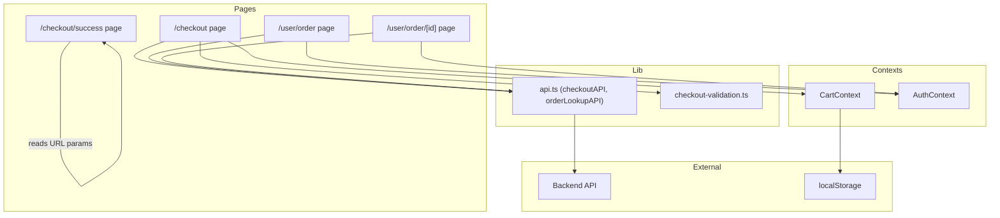
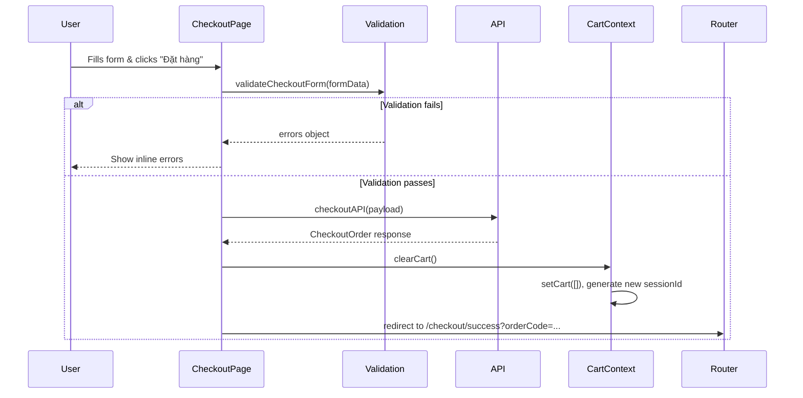

# Design Document: Checkout & Order Flow

## Overview

This design covers the complete frontend implementation of the checkout-to-order lifecycle for Duky Store. The system collects customer information via a validated form, submits it to the existing `POST /checkout` API, handles success/error responses, clears the cart post-checkout, displays order confirmation on a success page, and connects the order history and detail pages to the `GET /orders/:code?phone=` API.

All changes are frontend-only. The backend API contract is fixed and documented in `STOREFRONT-FE-API-CONTRACT.md`.

### Key Design Decisions

1. **Validation-first approach**: Client-side validation runs synchronously before any API call, providing instant feedback. The validation logic is extracted into a pure function (`validateCheckoutForm`) for testability.
2. **Cart clearing via new sessionId**: After successful checkout, a new `crypto.randomUUID()` replaces the old sessionId in localStorage. The cart state is cleared locally. The backend already marks the old cart as `CHECKED_OUT`.
3. **URL-param-based success page**: Order confirmation data (code, date, payment) is passed via URL search params rather than shared state, making the success page bookmarkable and refresh-safe.
4. **Order lookup by code + phone**: Since there's no `GET /customer/orders` endpoint, the order history page uses `GET /orders/:code?phone=` for individual lookups. For the MVP, orders are fetched by iterating known order codes stored in localStorage after checkout.
5. **Quick buy integration**: The quick buy flow adds the product to the cart via the existing Cart API before proceeding with the standard checkout, ensuring inventory validation happens server-side.

## Architecture



### Data Flow: Checkout Submission



## Components and Interfaces

### 1. Validation Module (`src/lib/checkout-validation.ts`)

```typescript
export interface CheckoutFormData {
  fullName: string;
  phone: string;
  email: string;
  province: string;
  district: string;
  ward: string;
  addressLine: string;
  paymentMethod: "COD" | "BANK_TRANSFER";
}

export interface ValidationErrors {
  fullName?: string;
  phone?: string;
  email?: string;
  province?: string;
  district?: string;
  ward?: string;
  addressLine?: string;
}

export function validateCheckoutForm(data: CheckoutFormData): ValidationErrors;
```

**Validation Rules:**
- `fullName`: Required, non-empty after trim
- `phone`: Required, length between 8 and 20 characters
- `email`: Optional, but if provided must be valid email format
- `province`, `district`, `ward`: All three required (non-empty)
- `addressLine`: Required, minimum 5 characters after trim

### 2. Order Lookup API (`src/lib/api.ts` addition)

```typescript
export async function orderLookupAPI(code: string, phone: string): Promise<CheckoutOrder>;
```

Calls `GET /orders/:code?phone=<phone>` and returns the order data.

### 3. CartContext Enhancement

Add a `clearCart` method to CartContext:

```typescript
interface CartContextType {
  // ... existing methods
  clearCart: () => void;
}
```

`clearCart()` implementation:
1. Sets cart state to `[]`
2. Generates a new UUID via `crypto.randomUUID()`
3. Stores new UUID in localStorage under `duky_cart_session`
4. Updates `sessionIdRef.current`

### 4. Order History Storage (`src/lib/order-storage.ts`)

Since there's no `GET /customer/orders` endpoint, we store order codes locally after checkout:

```typescript
const ORDER_HISTORY_KEY = "duky_order_history";

export interface StoredOrder {
  code: string;
  phone: string;
  date: string;
  paymentMethod: string;
}

export function saveOrderToHistory(order: StoredOrder): void;
export function getOrderHistory(): StoredOrder[];
export function clearOrderHistory(): void;
```

### 5. Checkout Page Component Updates

The existing `CheckoutContent` component will be refactored to:
- Use `validateCheckoutForm()` instead of inline `alert()` calls
- Display inline error messages below each field
- Handle quick buy flow by calling `addToCart` before rendering
- Call `clearCart()` on successful checkout
- Save order to local history before redirecting

### 6. Success Page Component

Already mostly implemented. Enhancements:
- Reads `orderCode`, `orderDate`, `payment` from URL search params
- Displays copy-to-clipboard for order code
- Shows payment method label based on param value
- Links to `/user/order` and `/` (continue shopping)

### 7. Order History Page

Replace mock data with real API calls:
- On mount, read stored order codes from localStorage
- For each code, call `orderLookupAPI(code, phone)` to get real data
- Support status filtering (client-side on fetched data)
- Support search by order code (client-side filter)

### 8. Order Detail Page

Replace mock data with real API call:
- Extract order code from URL params
- Call `orderLookupAPI(code, phone)` using customer phone from AuthContext
- Render order info card, items list, timeline, and shipping address

## Data Models

### CheckoutPayload (sent to API)

```typescript
interface CheckoutPayload {
  sessionId: string;          // from localStorage
  customerName: string;       // 2..120 chars
  customerPhone: string;      // 8..20 chars
  customerEmail?: string;     // optional email
  paymentMethod: "COD" | "BANK_TRANSFER";
  addressLine: string;        // 5..255 chars
  ward?: string;              // ward name (resolved from code)
  district?: string;          // district name (resolved from code)
  province?: string;          // province name (resolved from code)
  country?: string;           // default "VN"
  customerNote?: string;
  shippingNote?: string;
}
```

### CheckoutOrder (API response)

```typescript
interface CheckoutOrder {
  id: string;
  code: string;
  status: OrderStatus;
  paymentStatus: PaymentStatus;
  shippingStatus: ShippingStatus;
  customerName: string;
  customerPhone: string;
  customerEmail: string | null;
  subtotal: number;
  discountTotal: number;
  shippingFee: number;
  grandTotal: number;
  customerNote: string | null;
  createdAt: string;
  updatedAt: string;
  items: OrderItem[];
  payments: Payment[];
  shippingAddress: ShippingAddress | null;
  shipments: Shipment[];
  statusHistories: StatusHistory[];
}
```

### Local Order History Entry

```typescript
interface StoredOrder {
  code: string;
  phone: string;
  date: string;
  paymentMethod: string;
}
```

Stored as JSON array in `localStorage["duky_order_history"]`.

## Correctness Properties

*A property is a characteristic or behavior that should hold true across all valid executions of a system — essentially, a formal statement about what the system should do. Properties serve as the bridge between human-readable specifications and machine-verifiable correctness guarantees.*

### Property 1: Invalid form inputs produce validation errors

*For any* checkout form data where at least one field violates the validation rules (empty name, phone length outside [8,20], missing province/district/ward, or address shorter than 5 characters), `validateCheckoutForm` SHALL return a non-empty errors object with the corresponding field error message.

**Validates: Requirements 1.1, 1.2, 1.3, 1.4**

### Property 2: Valid form inputs pass validation

*For any* checkout form data where the name is non-empty, phone length is between 8 and 20, province/district/ward are all non-empty, and address is at least 5 characters, `validateCheckoutForm` SHALL return an empty errors object.

**Validates: Requirements 1.5**

### Property 3: Checkout payload construction preserves all form fields

*For any* valid form state and sessionId, the constructed `CheckoutPayload` SHALL contain the sessionId, trimmed customerName, trimmed customerPhone, paymentMethod mapped to API enum, resolved address line, ward name, district name, province name, and country defaulting to "VN".

**Validates: Requirements 2.1**

### Property 4: Successful checkout produces correct redirect URL

*For any* successful `CheckoutOrder` response with a code and createdAt timestamp, the constructed redirect URL SHALL contain `orderCode` equal to the order code, `orderDate` as a formatted Vietnamese date string, and `payment` matching the selected payment method.

**Validates: Requirements 2.2, 2.3**

### Property 5: API error messages are surfaced to the user

*For any* error response from the Checkout API containing an EM (error message) field, the checkout system SHALL display that exact message to the user.

**Validates: Requirements 3.5**

### Property 6: Post-checkout cart reset produces empty cart with new session

*For any* cart state before a successful checkout, after `clearCart()` is called, the cart items array SHALL be empty AND the sessionId in localStorage SHALL be a valid UUID different from the previous sessionId.

**Validates: Requirements 4.1, 4.2**

### Property 7: Success page renders all URL parameters

*For any* orderCode and orderDate URL search parameters, the success page SHALL render both values in the page output.

**Validates: Requirements 5.1, 5.2**

### Property 8: Order history renders all order fields

*For any* array of order data returned from the API, the order history page SHALL render each order's code, formatted date, status label, item count, and formatted grand total.

**Validates: Requirements 6.2**

### Property 9: Order history status filter shows only matching orders

*For any* list of orders with mixed statuses and any selected status filter (not "all"), the displayed orders SHALL all have the selected status, and no orders with a different status SHALL be displayed.

**Validates: Requirements 6.3**

### Property 10: Order history search filter matches order codes

*For any* list of orders and any non-empty search query string, the displayed orders SHALL all have codes that contain the search query (case-insensitive).

**Validates: Requirements 6.4**

### Property 11: Order detail renders info card and shipping address

*For any* valid order data with a shipping address, the order detail page SHALL render the order status, payment method, grand total, and all shipping address components (fullName, phone, addressLine, ward, district, province).

**Validates: Requirements 7.2, 7.5**

### Property 12: Order detail renders items and timeline

*For any* valid order data with items and status histories, the order detail page SHALL render each item's product name, SKU, quantity, unit price, and line total, AND each status history entry's status and date.

**Validates: Requirements 7.3, 7.4**

## Error Handling

### Checkout Form Errors
- **Inline validation errors**: Displayed below each field immediately on submit attempt. Errors clear when the user modifies the field.
- **Error state styling**: Fields with errors get a red border and error text in red below the input.

### API Errors (Checkout)
| Error Condition | User Message | Action |
|---|---|---|
| Cart empty | "Giỏ hàng trống. Vui lòng thêm sản phẩm." | Link to shop |
| Product out of stock | "Sản phẩm [name] đã hết hàng." | Stay on page |
| Variant inactive | "Phiên bản sản phẩm không còn khả dụng." | Stay on page |
| Network error/timeout | "Lỗi kết nối. Vui lòng thử lại." | Retry button |
| 400 validation error | Display `EM` from response | Stay on page |

### API Errors (Order Lookup)
| Error Condition | User Message | Action |
|---|---|---|
| Order not found (404) | "Không tìm thấy đơn hàng." | Link to order history |
| Network error | "Lỗi kết nối. Vui lòng thử lại." | Retry button |
| Unauthorized (phone mismatch) | "Không có quyền xem đơn hàng này." | Link to order history |

### Quick Buy Errors
| Error Condition | User Message | Action |
|---|---|---|
| Product not found | "Không tìm thấy sản phẩm." | Link to shop |
| Out of stock | "Sản phẩm đã hết hàng." | Link back to product |
| Add to cart fails | Display API error message | Link back to product |

## Testing Strategy

### Property-Based Testing

This feature is suitable for property-based testing because:
- The validation module is a pure function with clear input/output behavior
- Payload construction is a pure transformation
- Filtering logic (status filter, search) operates on data without side effects
- URL construction is a pure function

**Library**: `fast-check` (already standard for TypeScript/JavaScript PBT)

**Configuration**:
- Minimum 100 iterations per property test
- Each test tagged with: `Feature: checkout-order-flow, Property {N}: {description}`

### Unit Tests (Example-Based)

- Checkout form: loading state disables button (Req 2.4)
- Error handling: cart empty shows correct message (Req 3.1)
- Error handling: out of stock identifies product (Req 3.2)
- Error handling: variant inactive message (Req 3.3)
- Error handling: network error shows retry (Req 3.4)
- Success page: payment method label mapping (Req 5.3)
- Success page: links to order history and shop (Req 5.4, 5.5)
- Order history: empty state message (Req 6.5)
- Order history: error state with retry (Req 6.6)
- Order detail: error state with back link (Req 7.6)
- Quick buy: adds product to cart before checkout (Req 8.1)
- Quick buy: proceeds after successful add (Req 8.2)
- Quick buy: shows error on failure (Req 8.3)

### Integration Tests

- Order history page calls API with correct phone (Req 6.1)
- Order detail page calls API with correct code and phone (Req 7.1)
- Quick buy calls addToCart API with URL params (Req 8.1)
- Full checkout flow: form → API → redirect → success page

### Test File Structure

```
src/
├── lib/
│   ├── __tests__/
│   │   ├── checkout-validation.test.ts      (property tests + unit tests)
│   │   ├── checkout-payload.test.ts         (property tests)
│   │   ├── order-storage.test.ts            (unit tests)
│   │   └── order-filter.test.ts             (property tests)
├── app/(shop)/checkout/
│   └── __tests__/
│       └── checkout-page.test.tsx           (integration tests)
├── app/(shop)/checkout/success/
│   └── __tests__/
│       └── success-page.test.tsx            (property + unit tests)
├── app/(auth)/user/order/
│   └── __tests__/
│       ├── order-history.test.tsx           (property + unit tests)
│       └── order-detail.test.tsx            (property + unit tests)
```
