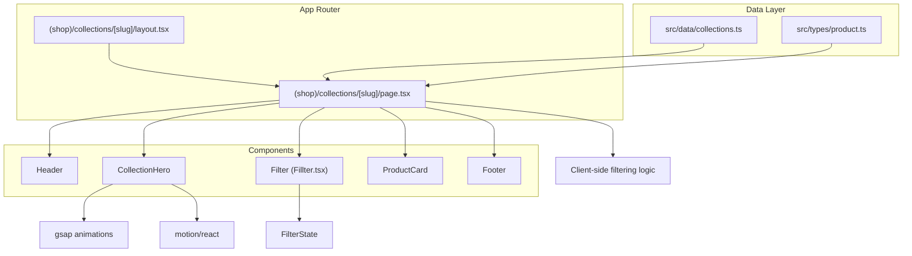
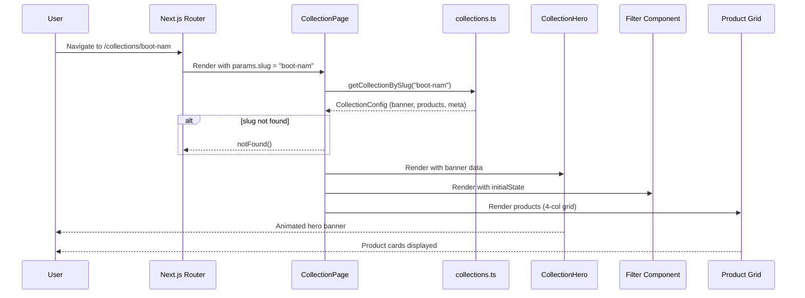
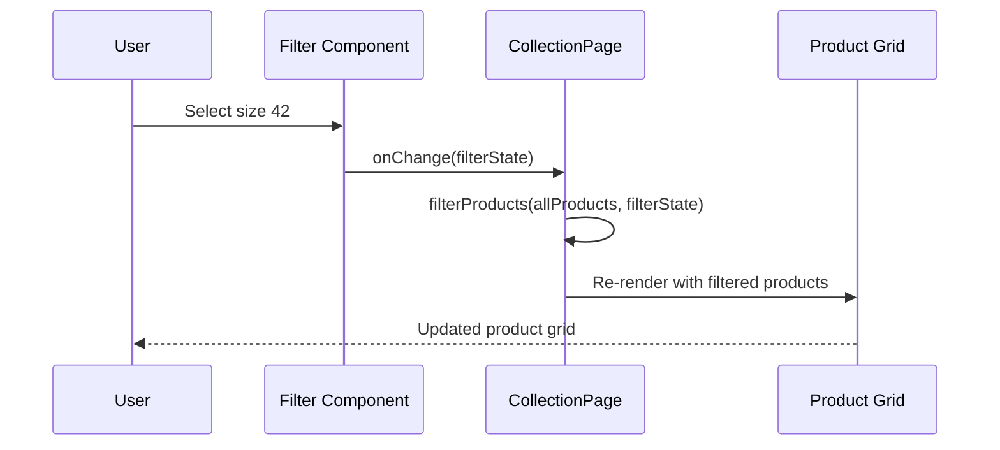

# Design Document: Collections Page

## Overview

The Collections Page is a dynamic route-based product listing page for Duky Store that displays curated boot collections filtered by gender. It supports two slugs: `boot-nam` (men's boots) and `boot-nu` (women's boots). Each collection features a hero banner with glassmorphism styling, trust badges, and a two-column layout with a filter sidebar and a responsive product grid.

The page reuses existing components (`ProductCard`, `Filter`, `Header`, `Footer`) and introduces a new `CollectionHero` component for the collection-specific banner. A centralized data configuration maps each slug to its banner content, product list, and metadata.

## Architecture



## Sequence Diagrams

### Page Load Flow



### Filter Interaction Flow



## Components and Interfaces

### Component 1: CollectionPage (page.tsx)

**Purpose**: Main page component that orchestrates the collection display, manages filter state, and coordinates between hero, filter, and product grid.

**Interface**:

```typescript
interface CollectionPageProps {
  params: Promise<{ slug: string }>;
}

// Internal state
interface CollectionPageState {
  filterState: FilterState;
  filteredProducts: Product[];
}
```

**Responsibilities**:

- Resolve slug from route params
- Look up collection configuration from data layer
- Return `notFound()` for invalid slugs
- Manage filter state and apply filtering logic
- Render layout: Hero → Filter + Grid

### Component 2: CollectionHero

**Purpose**: Full-width hero banner with glassmorphism effect, collection-specific content, product image, CTAs, social proof, and trust badges card.

**Interface**:

```typescript
interface CollectionHeroProps {
  label: string; // e.g. "PREMIUM MEN'S BOOTS"
  title: string; // e.g. "GIÀY BOOT NAM CAO CẤP"
  description: string; // Short description text
  image: string; // Hero product image path
  trustBadges: TrustBadge[];
  className?: string;
}

interface TrustBadge {
  icon: React.ReactNode;
  text: string;
}
```

**Responsibilities**:

- Display collection-specific banner content (label, title, description)
- Show large product image with gsap entrance animation
- Render CTA buttons ("Mua ngay", "Xem bộ sưu tập")
- Display social proof (avatar circles + customer count)
- Show trust badges card (Da bò thật, Bảo hành, Đổi trả, Giao hàng)

### Component 3: Filter (existing - Fillter.tsx)

**Purpose**: Sidebar filter with category, size, color, and price range controls.

**Interface** (existing):

```typescript
interface FilterProps {
  initialState?: Partial<FilterState>;
  onChange: (state: FilterState) => void;
  className?: string;
}

interface FilterState {
  category: string;
  sizes: number[];
  colors: string[];
  priceMin: number;
  priceMax: number;
}
```

**Responsibilities**:

- Provide category, size, color, and price filtering UI
- Emit filter state changes to parent

### Component 4: ProductCard (existing)

**Purpose**: Individual product display card with image, badge, price, rating, and cart action.

**Interface** (existing):

```typescript
interface ProductCardProps {
  product: Product;
  onAddToCart: (p: Product) => void;
  badge?: string;
  rating?: number;
  reviewsCount?: number;
  isFavorite?: boolean;
  onToggleFavorite?: (p: Product) => void;
  href?: string;
  variant?: "default" | "bestSeller";
  priority?: boolean;
  className?: string;
}
```

### Component 5: Layout (layout.tsx)

**Purpose**: Wraps collection pages with Header and Footer, manages cart state at layout level.

**Interface**:

```typescript
interface CollectionLayoutProps {
  children: React.ReactNode;
}
```

**Responsibilities**:

- Render Header with cart count and cart click handler
- Render CartDrawer for cart interactions
- Render Footer
- Provide consistent page structure with proper spacing for fixed header

## Data Models

### CollectionConfig

```typescript
interface CollectionConfig {
  slug: string;
  meta: CollectionMeta;
  hero: CollectionHero;
  products: Product[];
}

interface CollectionMeta {
  title: string; // Page/SEO title
  description: string; // Meta description
  gender: "male" | "female";
}

interface CollectionHero {
  label: string; // Small uppercase label
  title: string; // Large heading (Vietnamese)
  description: string; // Body text
  image: string; // Product image path
  ctaPrimary: string; // Primary CTA text
  ctaSecondary: string; // Secondary CTA text
}

interface TrustBadge {
  icon: React.ReactNode;
  text: string;
}
```

**Validation Rules**:

- `slug` must be one of: `"boot-nam"`, `"boot-nu"`
- `hero.image` must be a valid path in `/public/assets/`
- `products` array must contain at least 1 product
- All products must have valid `id`, `name`, `price`, and `img` fields

### Extended Product Type

```typescript
// Extends existing Product interface
interface Product {
  id: string;
  name: string;
  desc: string;
  price: number;
  formattedPrice: string;
  img: string;
  category: string;
  // New optional fields for collection display
  originalPrice?: number;
  badge?: string; // "BEST SELLER", "NEW", "-18%", etc.
  rating?: number; // 0-5 star rating
  reviewsCount?: number; // Number of reviews
  sizes?: number[]; // Available sizes
  colors?: string[]; // Available color IDs
  gender?: "male" | "female" | "unisex";
}
```

### Collection Data Map

```typescript
// src/data/collections.ts
const COLLECTIONS: Record<string, CollectionConfig> = {
  "boot-nam": {
    slug: "boot-nam",
    meta: { title: "Giày Boot Nam", description: "...", gender: "male" },
    hero: {
      label: "PREMIUM MEN'S BOOTS",
      title: "GIÀY BOOT NAM CAO CẤP",
      description: "Phong cách mạnh mẽ, chất liệu da bò thật...",
      image: "/assets/boot_nam.webp",
      ctaPrimary: "Mua ngay",
      ctaSecondary: "Xem bộ sưu tập",
    },
    products: [...],
  },
  "boot-nu": {
    slug: "boot-nu",
    meta: { title: "Giày Boot Nữ", description: "...", gender: "female" },
    hero: {
      label: "PREMIUM WOMEN'S BOOTS",
      title: "GIÀY BOOT NỮ CAO CẤP",
      description: "Thanh lịch, quyến rũ, tôn dáng...",
      image: "/assets/boot_nu.webp",
      ctaPrimary: "Mua ngay",
      ctaSecondary: "Xem bộ sưu tập",
    },
    products: [...],
  },
};
```

## Algorithmic Pseudocode

### Product Filtering Algorithm

```typescript
function filterProducts(
  products: Product[],
  filterState: FilterState,
): Product[] {
  // PRECONDITION: products is a non-empty array of valid Product objects
  // PRECONDITION: filterState contains valid filter criteria
  // POSTCONDITION: returns subset of products matching ALL active filters
  // POSTCONDITION: original products array is not mutated

  return products.filter((product) => {
    // Category filter (skip if "Tất cả")
    if (filterState.category !== "Tất cả") {
      if (product.category !== filterState.category) return false;
    }

    // Size filter (skip if no sizes selected)
    if (filterState.sizes.length > 0) {
      if (
        !product.sizes ||
        !product.sizes.some((s) => filterState.sizes.includes(s))
      ) {
        return false;
      }
    }

    // Color filter (skip if no colors selected)
    if (filterState.colors.length > 0) {
      if (
        !product.colors ||
        !product.colors.some((c) => filterState.colors.includes(c))
      ) {
        return false;
      }
    }

    // Price range filter
    if (
      product.price < filterState.priceMin ||
      product.price > filterState.priceMax
    ) {
      return false;
    }

    return true;
  });
}
```

**Preconditions:**

- `products` is a valid array (may be empty)
- `filterState` has valid numeric price bounds where `priceMin <= priceMax`
- `filterState.sizes` and `filterState.colors` are arrays (may be empty)

**Postconditions:**

- Returns a new array (no mutation of input)
- Every returned product satisfies ALL active filter criteria
- If all filters are at default, returns the full product list
- Result length ≤ input length

**Loop Invariants:**

- For each iteration: all previously evaluated products correctly included/excluded

### Slug Resolution Algorithm

```typescript
function resolveCollection(slug: string): CollectionConfig | null {
  // PRECONDITION: slug is a non-empty string from URL params
  // POSTCONDITION: returns CollectionConfig if slug is valid, null otherwise

  const config = COLLECTIONS[slug];
  return config ?? null;
}
```

**Preconditions:**

- `slug` is a string extracted from route params
- `COLLECTIONS` map is initialized with valid configurations

**Postconditions:**

- Returns `CollectionConfig` if slug exists in map
- Returns `null` if slug is not recognized
- No side effects

## Key Functions with Formal Specifications

### Function 1: getCollectionBySlug()

```typescript
function getCollectionBySlug(slug: string): CollectionConfig | undefined;
```

**Preconditions:**

- `slug` is a non-empty string
- Collections data module is loaded

**Postconditions:**

- Returns `CollectionConfig` object if slug matches a known collection
- Returns `undefined` if slug is not recognized
- No side effects, pure lookup

### Function 2: filterProducts()

```typescript
function filterProducts(products: Product[], state: FilterState): Product[];
```

**Preconditions:**

- `products` is a valid array of Product objects
- `state.priceMin <= state.priceMax`
- `state.priceMin >= 0`

**Postconditions:**

- Returns new array (input not mutated)
- `result.length <= products.length`
- Every item in result satisfies all active filter criteria
- If no filters active (default state), `result.length === products.length`

### Function 3: CollectionPage component render

```typescript
async function CollectionPage({
  params,
}: CollectionPageProps): Promise<JSX.Element>;
```

**Preconditions:**

- `params.slug` is provided by Next.js router
- Route is matched by `[slug]` dynamic segment

**Postconditions:**

- If slug is valid: renders full collection page (hero + filter + grid)
- If slug is invalid: calls `notFound()` (returns 404 page)
- Page is interactive (client component for filter state)

## Example Usage

```typescript
// Example 1: Navigating to men's boots collection
// URL: /collections/boot-nam
// Result: Page renders with men's boots hero banner and product grid

// Example 2: Collection data lookup
import { getCollectionBySlug } from "@/data/collections";

const collection = getCollectionBySlug("boot-nam");
// collection.hero.title === "GIÀY BOOT NAM CAO CẤP"
// collection.products.length > 0

// Example 3: Filtering products
const filtered = filterProducts(collection.products, {
  category: "Boot cổ cao",
  sizes: [42],
  colors: [],
  priceMin: 500000,
  priceMax: 2000000,
});
// Returns only "Boot cổ cao" products in size 42 within price range

// Example 4: Invalid slug handling
const invalid = getCollectionBySlug("invalid-slug");
// invalid === undefined → page calls notFound()

// Example 5: CollectionHero usage
<CollectionHero
  label="PREMIUM MEN'S BOOTS"
  title="GIÀY BOOT NAM CAO CẤP"
  description="Phong cách mạnh mẽ, chất liệu da bò thật..."
  image="/assets/boot_nam.webp"
  trustBadges={[
    { icon: <Shield />, text: "Da bò thật 100%" },
    { icon: <Award />, text: "Bảo hành 12 tháng" },
    { icon: <RotateCcw />, text: "Đổi trả 7 ngày" },
    { icon: <Truck />, text: "Giao hàng toàn quốc" },
  ]}
/>
```

## Correctness Properties

### Property 1: Slug Validity

∀ slug ∈ URL params: `getCollectionBySlug(slug) !== undefined` ⟹ page renders successfully; `getCollectionBySlug(slug) === undefined` ⟹ 404 response.

### Property 2: Filter Idempotency

∀ products, state: `filterProducts(filterProducts(products, state), state)` === `filterProducts(products, state)`.

### Property 3: Filter Subset

∀ products, state: `filterProducts(products, state).length <= products.length`.

### Property 4: Default Filter Identity

∀ products: `filterProducts(products, DEFAULT_FILTER_STATE)` === `products` (all products pass default filters).

### Property 5: No Mutation

∀ products, state: after `filterProducts(products, state)`, the original `products` array is unchanged.

### Property 6: Price Range Consistency

∀ product ∈ `filterProducts(products, state)`: `state.priceMin <= product.price <= state.priceMax`.

### Property 7: Category Consistency

If `state.category !== "Tất cả"`, then ∀ product ∈ result: `product.category === state.category`.

### Property 8: Layout Completeness

Every valid collection page renders Header, CollectionHero, Filter, ProductGrid, and Footer.

## Error Handling

### Error Scenario 1: Invalid Slug

**Condition**: User navigates to `/collections/invalid-slug` where slug is not in COLLECTIONS map
**Response**: Call Next.js `notFound()` function to render 404 page
**Recovery**: User sees 404 page with navigation back to home/collections

### Error Scenario 2: Empty Product List After Filtering

**Condition**: Filter criteria are too restrictive, resulting in 0 matching products
**Response**: Display empty state message ("Không tìm thấy sản phẩm phù hợp") with suggestion to adjust filters
**Recovery**: User can clear filters or adjust criteria

### Error Scenario 3: Image Load Failure

**Condition**: Product or hero image fails to load (broken path, network error)
**Response**: Next.js Image component shows placeholder/fallback via `onError` or CSS background
**Recovery**: Page remains functional; user can still interact with products

### Error Scenario 4: Missing Product Data Fields

**Condition**: Product lacks optional fields (rating, badge, originalPrice)
**Response**: Component gracefully handles undefined values (conditional rendering)
**Recovery**: Card renders without the missing elements; no runtime errors

## Testing Strategy

### Unit Testing Approach

- Test `getCollectionBySlug()` with valid and invalid slugs
- Test `filterProducts()` with various filter combinations
- Test that all known slugs return valid `CollectionConfig` objects
- Test edge cases: empty products array, all filters active, no filters active

### Property-Based Testing Approach

**Property Test Library**: fast-check

- **Filter subset property**: For any random filter state, filtered result length ≤ input length
- **Filter idempotency**: Applying the same filter twice yields the same result
- **Price range property**: All filtered products have prices within the specified range
- **No mutation property**: Original array reference and content unchanged after filtering

### Integration Testing Approach

- Test page renders correctly for each valid slug
- Test 404 behavior for invalid slugs
- Test filter interaction updates the product grid
- Test that Header and Footer render in layout
- Test responsive layout (sidebar collapses on mobile)

## Performance Considerations

- **Image Optimization**: Use Next.js `<Image>` with proper `sizes` and `priority` for hero image (LCP)
- **Client-side Filtering**: Filter logic runs in-browser using `useMemo` to avoid re-computation on unrelated re-renders
- **Component Lazy Loading**: Consider lazy loading the Filter component on mobile (below fold)
- **Product Grid Virtualization**: Not needed for current product count (~12 items), but consider if catalog grows
- **Animation Performance**: Use `will-change: transform` for gsap-animated elements; prefer `transform` and `opacity` for GPU-accelerated animations

## Security Considerations

- **Slug Validation**: Only allow known slugs; reject arbitrary input via `notFound()`
- **XSS Prevention**: All dynamic content rendered through React (auto-escaped); no `dangerouslySetInnerHTML`
- **Image Sources**: Only load images from `/public/assets/` (same-origin); Next.js Image handles domain restrictions

## Dependencies

| Dependency            | Purpose                                        | Version   |
| --------------------- | ---------------------------------------------- | --------- |
| next                  | App Router, dynamic routes, Image optimization | ^16.2.4   |
| react                 | UI rendering, hooks (useState, useMemo)        | ^19.0.1   |
| motion                | Page entrance animations, AnimatePresence      | ^12.23.24 |
| gsap                  | Hero banner entrance animations                | ^3.15.0   |
| lucide-react          | Icons (Shield, Truck, RotateCcw, etc.)         | ^0.546.0  |
| tailwind-merge + clsx | Conditional class merging via `cn()`           | existing  |

**Existing Components Reused**:

- `Header` from `@/components/layout`
- `Footer` from `@/components/layout`
- `ProductCard` from `@/components/shop`
- `Filter` from `@/components/shop/Fillter.tsx`
- `CartDrawer` from `@/components/shop`
- `cn()` and `formatCurrency()` from `@/lib/utils`

**New Files to Create**:

- `src/app/(shop)/collections/[slug]/page.tsx` — Main collection page
- `src/app/(shop)/collections/[slug]/layout.tsx` — Layout with Header/Footer
- `src/components/shop/CollectionHero.tsx` — Hero banner component
- `src/data/collections.ts` — Collection configuration data
