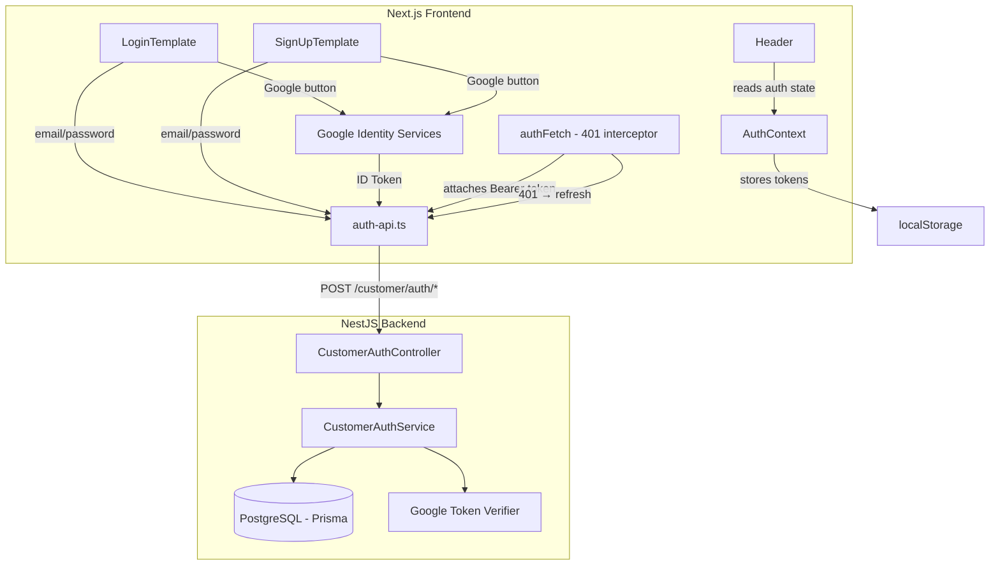

# Design Document: Customer Authentication (Google + Email/Password)

## Overview

This design covers the full customer authentication flow for Duky Store, spanning both the NestJS backend and the Next.js frontend. The backend already has a `customer-auth` module handling Google OAuth login, token refresh, logout, and profile retrieval. This design adds email/password registration and login endpoints to the backend, and builds the complete frontend authentication layer: an `AuthContext` for state management, API integration for the login/signup templates, Google Identity Services integration, and header avatar display.

### Key Design Decisions

1. **bcryptjs for password hashing** — already a dependency in the backend (`bcryptjs@^3.0.3`). Cost factor 10 provides a good balance of security and performance.
2. **Google Identity Services (GSI) via `@react-oauth/google`** — a lightweight React wrapper around Google's GSI library, providing a typed `useGoogleLogin` hook and `GoogleOAuthProvider`.
3. **Token storage in localStorage** — access and refresh tokens stored in `localStorage` for persistence across tabs and page reloads. The `AuthContext` manages in-memory state derived from storage.
4. **Axios-free approach** — the project uses native `fetch`. We'll build a thin authenticated fetch wrapper with 401 interception and token refresh queuing rather than adding axios.
5. **Rate limiting via in-memory store** — for the MVP, failed login attempts are tracked in a simple in-memory Map with TTL. This can be upgraded to Redis later.

## Architecture



### Request Flow

1. **Registration**: `SignUpTemplate` → `auth-api.register()` → `POST /api/v1/customer/auth/register` → `CustomerAuthService.register()` → bcrypt hash → Prisma create → issue token pair
2. **Email Login**: `LoginTemplate` → `auth-api.login()` → `POST /api/v1/customer/auth/login` → `CustomerAuthService.loginWithEmail()` → bcrypt compare → issue token pair
3. **Google Login**: `LoginTemplate/SignUpTemplate` → GSI popup → ID token → `auth-api.googleLogin()` → `POST /api/v1/customer/auth/google` → verify token → find/create customer → issue token pair
4. **Token Refresh**: `authFetch` intercepts 401 → `auth-api.refresh()` → `POST /api/v1/customer/auth/refresh` → rotate tokens → retry original request
5. **Logout**: `AuthContext.logout()` → `auth-api.logout()` → `POST /api/v1/customer/auth/logout` → revoke token → clear local state

## Components and Interfaces

### Backend Components

#### 1. RegisterDto (new)

```typescript
// src/modules/customer-auth/dto/register.dto.ts
import { IsEmail, IsString, MinLength, MaxLength } from 'class-validator';

export class RegisterDto {
  @IsEmail()
  email: string;

  @IsString()
  @MinLength(8)
  @MaxLength(72)
  password: string;

  @IsString()
  @MinLength(8)
  @MaxLength(72)
  passwordConfirmation: string;
}
```

#### 2. LoginDto (new)

```typescript
// src/modules/customer-auth/dto/login.dto.ts
import { IsEmail, IsString, MinLength } from 'class-validator';

export class LoginDto {
  @IsEmail()
  email: string;

  @IsString()
  @MinLength(8)
  password: string;
}
```

#### 3. CustomerAuthController (extended)

New endpoints added to the existing controller:

```typescript
@Post('register')
register(@Body() registerDto: RegisterDto, @Req() request: Request) { ... }

@Post('login')
login(@Body() loginDto: LoginDto, @Req() request: Request) { ... }
```

#### 4. CustomerAuthService (extended)

New methods:

```typescript
async register(registerDto: RegisterDto, requestMeta: RequestMeta) { ... }
async loginWithEmail(loginDto: LoginDto, requestMeta: RequestMeta) { ... }
private async checkRateLimit(email: string): void { ... }
private recordFailedAttempt(email: string): void { ... }
private clearFailedAttempts(email: string): void { ... }
```

### Frontend Components

#### 5. AuthContext (`src/context/AuthContext.tsx`)

```typescript
interface AuthState {
  isAuthenticated: boolean;
  isLoading: boolean;
  customer: CustomerProfile | null;
}

interface AuthContextValue extends AuthState {
  login: (email: string, password: string) => Promise<void>;
  register: (email: string, password: string, passwordConfirmation: string) => Promise<void>;
  googleLogin: (idToken: string) => Promise<void>;
  logout: () => Promise<void>;
  refresh: () => Promise<void>;
}
```

#### 6. authFetch (`src/lib/auth-fetch.ts`)

An authenticated fetch wrapper that:
- Attaches `Authorization: Bearer <accessToken>` header
- On 401 response, attempts token refresh (single in-flight refresh via promise deduplication)
- Queues concurrent requests during refresh
- Retries the original request once with the new token
- On refresh failure, clears auth state and redirects to `/login`

#### 7. auth-api.ts (`src/lib/auth-api.ts`)

```typescript
export async function loginWithEmail(email: string, password: string): Promise<AuthResponse> { ... }
export async function register(email: string, password: string, passwordConfirmation: string): Promise<AuthResponse> { ... }
export async function googleLogin(idToken: string): Promise<AuthResponse> { ... }
export async function refreshToken(refreshToken: string): Promise<AuthResponse> { ... }
export async function logout(refreshToken: string): Promise<{ success: boolean }> { ... }
export async function getProfile(): Promise<CustomerProfile> { ... }
```

#### 8. GoogleLoginButton (`src/components/shop/GoogleLoginButton.tsx`)

A reusable component wrapping `@react-oauth/google`'s `useGoogleLogin`:
- Renders the existing Google button UI from LoginTemplate/SignUpTemplate
- Handles the popup flow
- Calls `AuthContext.googleLogin()` with the received ID token
- Manages loading/disabled state during the flow

#### 9. Header (modified)

- Reads `AuthContext` state
- When authenticated: shows circular avatar (32×32 desktop, 28×28 mobile) with customer's Google picture or fallback initial
- When unauthenticated: shows existing `User` icon linking to `/login`
- Avatar links to `/account` (or future account page)

#### 10. Providers (modified)

Wraps children with `AuthProvider` (from AuthContext) and `GoogleOAuthProvider`:

```typescript
export function Providers({ children }: { children: React.ReactNode }) {
  return (
    <GoogleOAuthProvider clientId={process.env.NEXT_PUBLIC_GOOGLE_CLIENT_ID!}>
      <AuthProvider>
        <CartProvider>{children}</CartProvider>
      </AuthProvider>
    </GoogleOAuthProvider>
  );
}
```

## Data Models

### Backend API Response Format

All endpoints follow the existing response envelope:

```typescript
interface ApiResponse<T> {
  EC: number;  // 0 = success, non-zero = error
  EM: string;  // error/success message
  DT: T;       // data payload
}
```

### Auth Response Payload (DT)

```typescript
interface AuthResponseData {
  tokenType: 'Bearer';
  accessToken: string;
  refreshToken: string;
  accessExpiresIn: string;  // e.g. "15m"
  refreshExpiresIn: string; // e.g. "7d"
  customer: CustomerProfile;
}
```

### CustomerProfile (shared type)

```typescript
interface CustomerProfile {
  id: string;
  email: string;
  fullName: string;
  phone: string | null;
  status: 'ACTIVE' | 'BLOCKED';
  type: 'NEW' | 'REGULAR' | 'VIP' | 'WHOLESALE';
  emailVerifiedAt: string | null; // ISO date string
}
```

### Rate Limit Store (in-memory)

```typescript
interface FailedAttemptRecord {
  count: number;
  firstAttemptAt: number; // timestamp
  lockedUntil: number | null; // timestamp
}
// Map<email, FailedAttemptRecord>
```

### localStorage Keys

| Key | Value |
|-----|-------|
| `duky_access_token` | JWT access token string |
| `duky_refresh_token` | Opaque refresh token string |


## Correctness Properties

*A property is a characteristic or behavior that should hold true across all valid executions of a system — essentially, a formal statement about what the system should do. Properties serve as the bridge between human-readable specifications and machine-verifiable correctness guarantees.*

### Property 1: Registration and Login Round-Trip

*For any* valid email (properly formatted) and valid password (8–72 characters), registering a new customer and then logging in with the same email and password SHALL return a successful authentication response containing an access token, refresh token, and a customer profile with matching email (lowercased).

**Validates: Requirements 1.1, 2.1**

### Property 2: Email Normalization Idempotence

*For any* email string with mixed-case characters, the system SHALL normalize it to lowercase before storage and before lookup, such that registering with `Foo@Bar.COM` and logging in with `foo@bar.com` (or any other case variation) SHALL authenticate the same customer.

**Validates: Requirements 1.6, 2.5**

### Property 3: Invalid Registration Input Rejection

*For any* registration input where the password length is outside [8, 72] characters, OR the email does not match a valid email format, OR the password and passwordConfirmation differ, the system SHALL return a validation error and SHALL NOT create a customer record.

**Validates: Requirements 1.3, 1.5, 1.7**

### Property 4: Duplicate Email Rejection

*For any* email that already exists in the system (case-insensitive), attempting to register with that email SHALL return an error indicating the email is already registered, and the error message SHALL NOT reveal whether the existing account was created via email or Google.

**Validates: Requirements 1.2**

### Property 5: Password Hash Verification Round-Trip

*For any* valid password provided during registration, the stored bcrypt hash SHALL verify successfully against the original password using bcrypt compare, and the hash cost factor SHALL be at least 10.

**Validates: Requirements 1.4**

### Property 6: Login Error Uniformity

*For any* login attempt where either the email does not exist in the system OR the password does not match the stored hash, the system SHALL return an identical error response (same error code and message structure) for both cases, preventing email enumeration.

**Validates: Requirements 2.3**

### Property 7: Invalid Login Input Rejection Without Authentication

*For any* login input where the email format is invalid OR the password is fewer than 8 characters, the system SHALL return a validation error without attempting password verification or database lookup.

**Validates: Requirements 2.2**

### Property 8: Google Login Creates Customer with Correct Profile

*For any* valid Google token containing a new email (not in the system), the system SHALL create a customer with: the email lowercased, fullName set to the Google profile name (or email local-part if name is empty), status ACTIVE, and emailVerifiedAt set to the current timestamp.

**Validates: Requirements 3.2, 3.6**

### Property 9: Google Login Preserves Existing Customer Data

*For any* existing active customer, authenticating via Google with the same email SHALL NOT modify the customer's fullName, phone, status, or type fields.

**Validates: Requirements 3.3**

### Property 10: Token Refresh Rotation

*For any* valid (non-revoked, non-expired) refresh token, calling the refresh endpoint SHALL return a new access token and refresh token pair, AND the original refresh token SHALL no longer be usable for subsequent refresh calls.

**Validates: Requirements 4.1**

### Property 11: Revoked Token Triggers Full Revocation

*For any* refresh token that has been revoked (used once already), attempting to use it again SHALL cause all refresh tokens for that customer to be revoked, and SHALL return an unauthorized error.

**Validates: Requirements 4.2**

### Property 12: Logout Idempotence

*For any* string provided as a refresh token (valid, invalid, already revoked, or expired), calling the logout endpoint SHALL return a success response (`{ success: true }`), never an error.

**Validates: Requirements 5.1, 5.2**

### Property 13: 401 Interceptor with Refresh Queuing

*For any* set of N concurrent API requests that all receive 401 responses while a valid refresh token exists, the auth-fetch layer SHALL trigger exactly one refresh call, and all N requests SHALL be retried with the new access token and resolve successfully.

**Validates: Requirements 6.4, 6.5**

### Property 14: Invalid Tokens Rejected

*For any* string that does not correspond to a valid, non-expired token in the system (random strings, malformed JWTs, expired tokens), the refresh endpoint and the profile endpoint SHALL return an unauthorized error.

**Validates: Requirements 4.6, 9.2**

### Property 15: Profile Endpoint Excludes Sensitive Fields

*For any* authenticated customer, the profile endpoint response SHALL contain only the fields: id, email, fullName, phone, status, type, and emailVerifiedAt. The response SHALL NOT contain passwordHash, deletedAt, or any other internal fields.

**Validates: Requirements 9.1**

### Property 16: Avatar Renders with Accessible Name

*For any* authenticated customer with a non-empty fullName, the header avatar SHALL have an alt attribute containing the customer's fullName, AND if the avatar image fails to load, the fallback SHALL display the first character of fullName as an uppercase letter.

**Validates: Requirements 8.4, 8.5**

## Error Handling

### Backend Error Responses

All errors follow the standard `ApiResponse` envelope with `EC !== 0`:

| Scenario | EC | HTTP Status | EM |
|----------|-----|-------------|-----|
| Validation error (bad email, short password, mismatch) | 1 | 400 | Specific validation messages |
| Email already registered | 2 | 409 | "Email đã được đăng ký" |
| Invalid credentials (wrong email or password) | 3 | 401 | "Email hoặc mật khẩu không đúng" |
| Account blocked | 4 | 403 | "Tài khoản đã bị khóa" |
| Invalid/expired token | 5 | 401 | "Token không hợp lệ" |
| Rate limited | 6 | 429 | "Quá nhiều lần thử, vui lòng đợi 15 phút" |
| Google token invalid | 7 | 401 | "Google token không hợp lệ" |
| Google email not verified | 8 | 401 | "Email Google chưa được xác minh" |

### Frontend Error Handling

- **Network errors**: Display a generic "Không thể kết nối đến server" toast/message
- **Validation errors (EC=1)**: Display field-level error messages from the `EM` field
- **Auth errors (EC=3,5)**: Display the error message, clear any stale tokens
- **Rate limit (EC=6)**: Display countdown timer or message about waiting
- **Google errors (EC=7,8)**: Display "Đăng nhập Google thất bại" with option to retry

### Edge Cases

- **Concurrent tab logout**: If one tab logs out, other tabs should detect the token removal from localStorage via `storage` event and update their state
- **Token refresh race**: Only one refresh request in-flight at a time; concurrent 401s queue behind the single refresh promise
- **Google popup blocked**: If the browser blocks the popup, show a message suggesting the user allow popups
- **Avatar image timeout**: 3-second timeout on avatar image load before showing fallback

## Testing Strategy

### Backend Testing (Jest)

**Unit Tests:**
- `CustomerAuthService.register()` — valid registration, duplicate email, validation errors
- `CustomerAuthService.loginWithEmail()` — valid login, wrong password, non-existent email, blocked account, rate limiting
- `CustomerAuthService.loginWithGoogle()` — valid token, invalid token, new customer creation, existing customer login
- `CustomerAuthService.refresh()` — valid refresh, revoked token, expired token
- `CustomerAuthService.logout()` — valid token, invalid token (idempotence)
- `CustomerAuthService.me()` — active customer, blocked customer, deleted customer

**Property-Based Tests (using `fast-check` with Jest):**
- Property 1: Registration + Login round-trip
- Property 2: Email normalization idempotence
- Property 3: Invalid input rejection
- Property 4: Duplicate email rejection
- Property 5: Password hash verification
- Property 6: Login error uniformity
- Property 10: Token refresh rotation
- Property 11: Revoked token full revocation
- Property 12: Logout idempotence
- Property 14: Invalid tokens rejected
- Property 15: Profile excludes sensitive fields

Each property test runs minimum 100 iterations with `fast-check`.
Tag format: `Feature: customer-auth-google, Property {N}: {title}`

**Integration Tests:**
- Google token verification with mocked HTTP responses
- Full auth flow: register → login → refresh → logout
- Rate limiting behavior (5 attempts → lockout)

### Frontend Testing (Jest + React Testing Library)

**Unit Tests:**
- `AuthContext` — state transitions, token storage, refresh logic
- `authFetch` — 401 interception, refresh queuing, retry behavior
- `auth-api.ts` — correct API calls with proper payloads

**Property-Based Tests (using `fast-check`):**
- Property 13: 401 interceptor with refresh queuing
- Property 16: Avatar renders with accessible name

**Component Tests:**
- `LoginTemplate` — form submission, validation display, loading states
- `SignUpTemplate` — form submission, validation display, terms checkbox
- `GoogleLoginButton` — click handling, disabled state, error display
- `Header` — avatar vs icon display based on auth state, fallback rendering

### New Dependencies Required

**Backend:**
- None new — `bcryptjs` already in dependencies

**Frontend:**
- `@react-oauth/google` — React wrapper for Google Identity Services
- `fast-check` (devDependency) — property-based testing library
