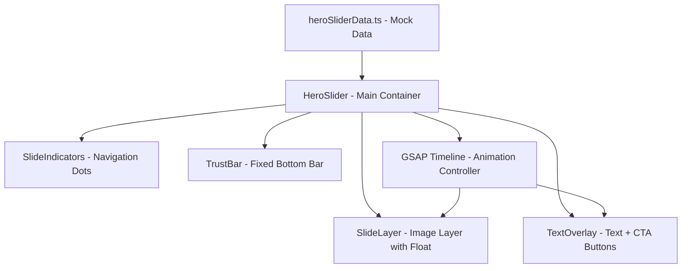
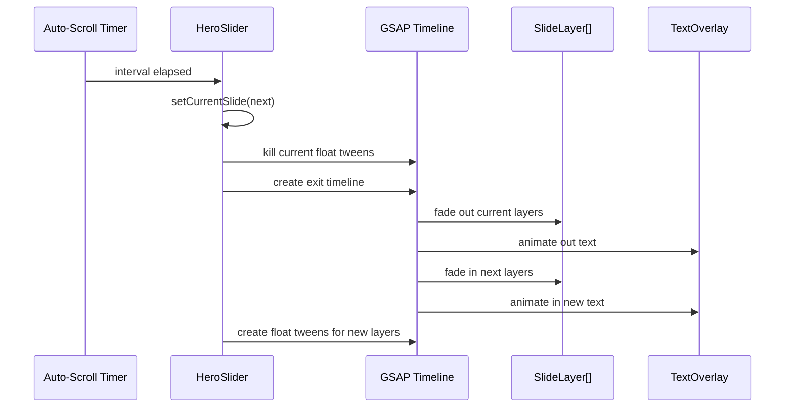
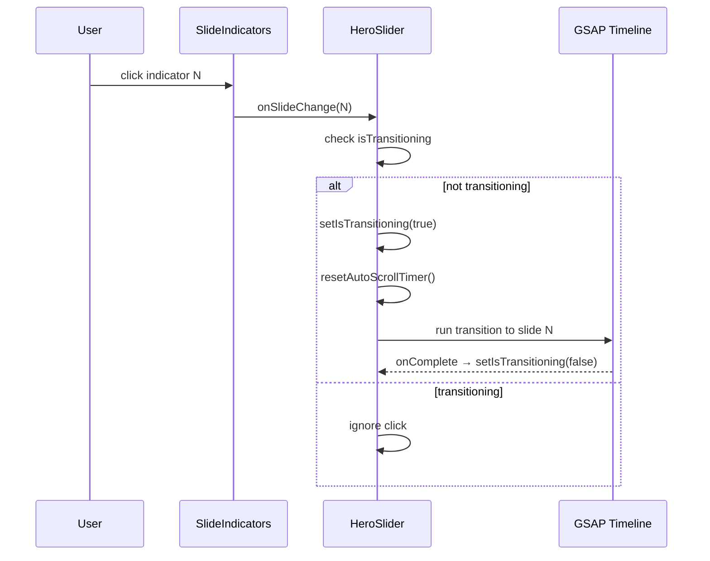

# Design Document: Hero Banner Slider

## Overview

This feature transforms the existing static `HeroBanner` component into a multi-slide, multi-layer animated slider. Each slide supports up to 8 stacked image layers with GSAP-powered floating animations, creating a parallax-like depth effect. The topmost layer contains code-based text content (title, subtitle, tagline, CTA buttons) that animates between slides. A trust bar remains fixed at the bottom, and slide indicators provide navigation. Slide data is sourced from a mock data file that can be swapped for API calls later.

The architecture replaces the current `HeroBanner` component with a new `HeroSlider` component composed of `SlideLayer`, `TextOverlay`, `SlideIndicators`, and `TrustBar` sub-components. GSAP handles all animations: floating layers, slide transitions, and text entry/exit effects.

## Architecture



## Sequence Diagrams

### Slide Transition Flow



### User Indicator Click Flow



## Components and Interfaces

### Component 1: HeroSlider

**Purpose**: Main container component that orchestrates slide state, auto-scroll timer, GSAP animations, and visibility API handling.

**Interface**:
```typescript
interface HeroSliderProps {
  slides?: SlideConfig[];
  autoScrollInterval?: number; // ms, default 5000, min 3000, max 10000
  transitionDuration?: number; // ms, default 800
  trustItems?: TrustItem[];
  className?: string;
}
```

**Responsibilities**:
- Manage current slide index state
- Control auto-scroll timer (pause on hover, reset on manual navigation)
- Coordinate GSAP timelines for slide transitions
- Handle Page Visibility API to pause/resume animations
- Validate slide data and apply fallback when empty/invalid
- Prevent overlapping transitions via `isTransitioning` guard

### Component 2: SlideLayer

**Purpose**: Renders a single image layer within a slide with absolute positioning and GSAP floating animation.

**Interface**:
```typescript
interface SlideLayerProps {
  src: string;
  alt: string;
  zIndex: number;
  floatConfig: FloatAnimationConfig;
  isActive: boolean;
  onError?: () => void;
}
```

**Responsibilities**:
- Render image with absolute positioning and assigned z-index
- Register GSAP floating tween when active
- Kill floating tween when inactive
- Handle image load errors gracefully (hide self)
- Apply responsive displacement limits on mobile

### Component 3: TextOverlay

**Purpose**: Renders the text content layer (badge, title, tagline, CTA buttons) above all image layers with GSAP entry/exit animations.

**Interface**:
```typescript
interface TextOverlayProps {
  content: SlideTextContent;
  isActive: boolean;
  transitionDuration: number;
}
```

**Responsibilities**:
- Render badge label, main title, tagline, and CTA buttons
- Animate text in/out using GSAP (staggered fade + translate)
- Maintain z-index above all image layers (z-index ≥ 10)
- Ensure minimum 4.5:1 contrast ratio via semi-transparent backdrop
- Use code-based rendering (React + Tailwind), not image text

### Component 4: SlideIndicators

**Purpose**: Renders navigation dots showing current slide position and allowing manual slide selection.

**Interface**:
```typescript
interface SlideIndicatorsProps {
  total: number;
  current: number;
  onSelect: (index: number) => void;
  disabled?: boolean;
}
```

**Responsibilities**:
- Render one indicator per slide
- Visually distinguish active indicator (expanded width + color change)
- Call `onSelect` on click (ignored if `disabled` or already active)
- Provide accessible aria-labels ("Slide 1 of 3")
- Minimum 44×44px tap target on mobile

### Component 5: TrustBar

**Purpose**: Fixed bottom bar displaying service trust items (shipping, warranty, etc.) that persists across slide transitions.

**Interface**:
```typescript
interface TrustBarProps {
  items: TrustItem[];
  className?: string;
}
```

**Responsibilities**:
- Render at bottom of slider container with absolute positioning
- Maintain higher z-index than slide layers
- Remain completely static during transitions (no opacity/transform changes)
- Hide entirely when items array is empty

## Data Models

### SlideConfig

```typescript
interface SlideConfig {
  id: string;
  layers: LayerConfig[];
  text: SlideTextContent;
  animation?: SlideAnimationConfig;
}

interface LayerConfig {
  src: string;           // path relative to public/
  alt: string;
  zIndex: number;        // 0-100
  float?: FloatAnimationConfig;
}

interface FloatAnimationConfig {
  duration: number;      // seconds, 3-6
  delay: number;         // seconds, 0-2
  displacement: number;  // pixels, 5-15 (capped at 10 on mobile)
  ease: string;          // GSAP easing, e.g. "sine.inOut"
}

interface SlideTextContent {
  badge: string;         // max 50 chars
  title: string;         // max 100 chars
  tagline: string;       // max 200 chars
  buttons: CTAButton[];  // max 3 buttons
}

interface CTAButton {
  label: string;
  link: string;
  variant: "primary" | "secondary";
}

interface SlideAnimationConfig {
  duration: number;      // ms, 200-2000
  ease: string;          // GSAP easing function name
  entryDirection: "left" | "right" | "fade";
}
```

### TrustItem

```typescript
interface TrustItem {
  icon: React.ReactNode;
  title: string;
  desc: string;
}
```

### Slider State

```typescript
interface SliderState {
  currentSlide: number;
  isTransitioning: boolean;
  isPaused: boolean;        // true when tab hidden or hovered
  isTabVisible: boolean;
}
```

**Validation Rules**:
- `SlideConfig.layers` must have 1-8 entries
- `SlideConfig.text.badge` max 50 characters
- `SlideConfig.text.title` max 100 characters, required
- `SlideConfig.text.tagline` max 200 characters
- `SlideConfig.text.buttons` max 3 entries
- `LayerConfig.zIndex` must be integer 0-100
- `FloatAnimationConfig.duration` must be 3-6 seconds
- `FloatAnimationConfig.delay` must be 0-2 seconds
- `FloatAnimationConfig.displacement` must be 5-15px
- `autoScrollInterval` must be 3000-10000ms
- Slides array must have 1-10 entries
- If slides array is empty/invalid, render fallback with current default hero content

## GSAP Animation Strategy

### Floating Layers

Each active layer gets an independent GSAP tween:

```typescript
// Per-layer floating animation
gsap.to(layerRef, {
  y: `+=${displacement}`,
  duration: duration,
  delay: delay,
  ease: "sine.inOut",
  yoyo: true,
  repeat: -1,  // infinite loop
});
```

- Each layer has unique duration (3-6s) and delay (0-2s) to prevent synchronization
- On slide change: kill all current float tweens, create new ones for incoming layers
- On tab hidden: `gsap.globalTimeline.pause()`
- On tab visible: `gsap.globalTimeline.resume()`

### Slide Transitions

Crossfade transition using a GSAP timeline:

```typescript
const tl = gsap.timeline({
  onStart: () => setIsTransitioning(true),
  onComplete: () => setIsTransitioning(false),
});

// Exit current slide layers
tl.to(currentLayersRef, {
  opacity: 0,
  duration: 0.4,
  stagger: 0.05,
});

// Enter next slide layers
tl.fromTo(nextLayersRef, 
  { opacity: 0 },
  { opacity: 1, duration: 0.4, stagger: 0.05 },
  "-=0.2" // overlap for crossfade
);
```

### Text Overlay Transitions

Staggered text animation within the 800ms total budget:

```typescript
// Exit text
tl.to(textElements, {
  opacity: 0,
  y: -20,
  duration: 0.3,
  stagger: 0.05,
}, 0);

// Enter new text
tl.fromTo(newTextElements,
  { opacity: 0, y: 20 },
  { opacity: 1, y: 0, duration: 0.3, stagger: 0.08 },
  0.4
);
```

### Page Visibility Handling

```typescript
useEffect(() => {
  const handleVisibility = () => {
    if (document.hidden) {
      gsap.globalTimeline.pause();
    } else {
      gsap.globalTimeline.resume();
    }
  };
  document.addEventListener("visibilitychange", handleVisibility);
  return () => document.removeEventListener("visibilitychange", handleVisibility);
}, []);
```

## State Management

State is managed via React hooks within `HeroSlider`:

```typescript
// Core state
const [currentSlide, setCurrentSlide] = useState(0);
const [isTransitioning, setIsTransitioning] = useState(false);
const [isPaused, setIsPaused] = useState(false);

// Refs for GSAP
const sliderRef = useRef<HTMLDivElement>(null);
const layerRefs = useRef<Map<string, HTMLDivElement>>(new Map());
const textRef = useRef<HTMLDivElement>(null);
const autoScrollTimerRef = useRef<NodeJS.Timeout | null>(null);
const floatTweensRef = useRef<gsap.core.Tween[]>([]);

// Auto-scroll logic
useEffect(() => {
  if (isPaused || isTransitioning) return;
  
  autoScrollTimerRef.current = setTimeout(() => {
    const next = (currentSlide + 1) % slides.length;
    transitionToSlide(next);
  }, autoScrollInterval);

  return () => {
    if (autoScrollTimerRef.current) {
      clearTimeout(autoScrollTimerRef.current);
    }
  };
}, [currentSlide, isPaused, isTransitioning]);
```

### Hover Pause (Desktop Only)

```typescript
const handleMouseEnter = () => {
  if (window.innerWidth >= 1024) {
    setIsPaused(true);
  }
};

const handleMouseLeave = () => {
  setIsPaused(false);
  // Timer resets via useEffect dependency on isPaused
};
```

## File Structure

```
src/
├── components/
│   └── shop/
│       └── home/
│           ├── HeroSlider/
│           │   ├── index.tsx           # HeroSlider main component
│           │   ├── SlideLayer.tsx       # Individual image layer
│           │   ├── TextOverlay.tsx      # Text content overlay
│           │   ├── SlideIndicators.tsx  # Navigation dots
│           │   └── TrustBar.tsx         # Fixed bottom trust bar
│           ├── HeroBanner.tsx           # Existing (kept as fallback)
│           └── ...other sections
├── data/
│   └── heroSlider.ts                   # Mock slide data
├── types/
│   └── heroSlider.ts                   # TypeScript interfaces
public/
├── assets/
│   ├── slider_1/                       # Slide 1 layers
│   │   ├── background.png
│   │   ├── boot.png
│   │   └── model.png
│   ├── slider_2/                       # Slide 2 layers (to be added)
│   └── slider_3/                       # Slide 3 layers (to be added)
```

## Error Handling

### Layer Image Load Failure

**Condition**: An image in a layer fails to load (404, network error)
**Response**: Hide that specific layer (`display: none`), other layers render normally
**Recovery**: No retry; layer remains hidden for the slide's lifetime

### All Layers Fail / Empty Slide

**Condition**: All layer images for a slide fail or directory has no images
**Response**: Skip that slide, advance to next valid slide
**Recovery**: If all slides are invalid, render fallback (current default hero banner content)

### Empty/Invalid Slide Data

**Condition**: Slides array is empty, undefined, or all entries are invalid
**Response**: Render single slide with default hero banner content (badge: "SUMMER COLLECTION", existing background, title, description, buttons)
**Recovery**: Component remains functional with static content

### Transition Overlap Prevention

**Condition**: User clicks indicator during an active transition
**Response**: Ignore the click (via `isTransitioning` guard)
**Recovery**: Indicator becomes clickable again after transition completes

## Testing Strategy

### Unit Testing Approach

- Test slide data validation (invalid entries filtered, fallback triggered)
- Test state transitions (slide index cycling, pause/resume logic)
- Test component rendering with various data configurations
- Test accessibility attributes on indicators

### Property-Based Testing Approach

**Property Test Library**: fast-check (already installed)

- Validate that float animation configs always produce unique duration-delay combinations per slide
- Validate that slide data validation correctly filters invalid entries for any input
- Validate auto-scroll timer behavior across state transitions

### Integration Testing Approach

- Test full slider lifecycle: mount → auto-scroll → transition → unmount
- Test hover pause/resume on desktop viewports
- Test indicator navigation with transition guard

## Performance Considerations

- Use `next/image` with `priority` for first slide layers, lazy load subsequent slides
- GSAP tweens use `will-change: transform, opacity` for GPU acceleration
- Kill all tweens on unmount to prevent memory leaks
- Limit floating animation displacement on mobile to reduce paint area
- Use `requestAnimationFrame`-aligned GSAP (default behavior)

## Security Considerations

- Image paths from mock data are validated to start with `/assets/`
- CTA button links are rendered via Next.js `Link` component (handles XSS protection)
- No user-generated content in slider data (mock data is developer-controlled)

## Dependencies

- **gsap** (^3.15.0) - Already installed. Handles all animations
- **next/image** - Image optimization and lazy loading
- **lucide-react** - Arrow icon for CTA buttons (already used)
- **tailwind-merge** / **clsx** - Conditional class composition (already used)

## Correctness Properties

*A property is a characteristic or behavior that should hold true across all valid executions of a system — essentially, a formal statement about what the system should do. Properties serve as the bridge between human-readable specifications and machine-verifiable correctness guarantees.*

### Property 1: Float animation config validity and uniqueness

*For any* slide with N layers (N ≥ 2), the generated float animation configurations shall all have duration in [3, 6] seconds, delay in [0, 2] seconds, displacement in [5, 15] pixels, and no two layers shall share the same (duration, delay) combination.

**Validates: Requirements 2.2, 2.3**

### Property 2: Slide data validation preserves valid entries and filters invalid ones

*For any* array of slide configuration objects (including mixtures of valid and invalid entries), the validation function shall return only entries that have at least one valid layer path and a non-empty title, preserving their original relative order, and shall return the fallback slide when zero valid entries remain.

**Validates: Requirements 8.1, 8.2, 8.4**

### Property 3: Auto-scroll index cycling wraps correctly

*For any* slider with N valid slides (N ≥ 1) and current index I (0 ≤ I < N), the next slide index after an auto-scroll tick shall be (I + 1) mod N.

**Validates: Requirements 3.2, 3.3**

### Property 4: Transition guard prevents concurrent transitions

*For any* sequence of slide change requests received while `isTransitioning` is true, the current slide index shall remain unchanged until the active transition completes.

**Validates: Requirements 5.5, 3.7**

### Property 5: Layer z-index ordering matches alphabetical filename sort

*For any* set of layer filenames within a slide, the assigned z-index values shall correspond to the alphabetical ascending sort order of those filenames, starting at 0.

**Validates: Requirements 1.2**

### Property 6: Mobile displacement cap

*For any* float animation configuration applied on a viewport below 768px, the displacement value shall not exceed 10px regardless of the configured value.

**Validates: Requirements 7.4**
