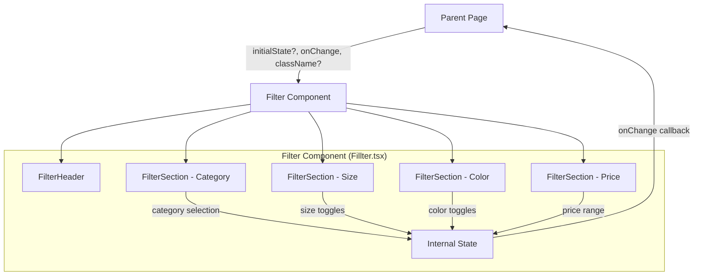

# Design Document: Product Filter

## Overview

The Product Filter is a client-side sidebar component (`Fillter.tsx`) for the Duky Store e-commerce application. It provides category, size, color, and price range filtering with collapsible sections, smooth animations, and a clear-all action. The component manages its own internal state via React `useState` and communicates filter changes to the parent via an `onChange` callback prop.

The component is implemented as a single file containing the main `Filter` export and internal sub-components for each filter section. It uses the `motion/react` library for collapse/expand animations and the project's `cn()` utility for conditional Tailwind class merging.

## Architecture



**Key architectural decisions:**

1. **Single-file component**: All sub-components live in `Fillter.tsx` for cohesion. They are not exported — only `Filter` and `FilterState` are public.
2. **Internal state with callback**: The component owns its state via `useState`. On every state change, it calls `onChange` with the complete `FilterState`. This keeps the component self-contained while allowing the parent to react to changes.
3. **Controlled initial state**: The `initialState` prop seeds the internal state on mount. The component does not re-sync if `initialState` changes after mount (uncontrolled pattern with initial value).
4. **Sub-components receive state + handlers**: Each filter section receives its slice of state and a handler to update it, keeping rendering logic isolated.

## Components and Interfaces

### Exported Interface

```typescript
export interface FilterState {
  category: string;        // Selected category label, defaults to "Tất cả"
  sizes: number[];         // Array of selected size numbers (e.g., [39, 42])
  colors: string[];        // Array of selected color identifiers (e.g., ["black", "tan"])
  priceMin: number;        // Minimum price in VND (integer)
  priceMax: number;        // Maximum price in VND (integer)
}
```

### Exported Component Props

```typescript
interface FilterProps {
  initialState?: Partial<FilterState>;
  onChange: (state: FilterState) => void;
  className?: string;
}
```

### Internal Sub-Components

| Sub-Component | Responsibility |
|---|---|
| `FilterHeader` | Renders "BỘ LỌC" title and "Xóa tất cả" button |
| `FilterSection` | Generic collapsible wrapper with title, chevron icon, AnimatePresence animation |
| `CategoryFilter` | Radio button list for category selection |
| `SizeFilter` | Grid of toggle buttons for size multi-select |
| `ColorFilter` | Color swatch grid with checkmark overlay + "+" expand button |
| `PriceFilter` | Dual-range slider with two native `<input type="range">` overlaid + formatted number inputs |

### FilterSection (Generic Collapsible)

```typescript
interface FilterSectionProps {
  title: string;
  defaultExpanded?: boolean;  // defaults to true
  children: React.ReactNode;
}
```

Uses `useState<boolean>` for expanded state. Wraps children in `AnimatePresence` + `motion.div` with `initial={{ height: 0, opacity: 0 }}`, `animate={{ height: "auto", opacity: 1 }}`, `exit={{ height: 0, opacity: 0 }}` and `transition={{ duration: 0.25 }}`.

### PriceFilter (Dual Range Slider)

The dual-range slider is implemented by overlaying two native `<input type="range">` elements:

```
┌─────────────────────────────────────────┐
│  [===min-thumb====TRACK====max-thumb===] │
│                                         │
│  ┌──────────┐       ┌──────────┐       │
│  │ 190.000đ │       │1.500.000đ│       │
│  └──────────┘       └──────────┘       │
└─────────────────────────────────────────┘
```

- Both inputs share the same absolute positioning and track styling
- The min input has `z-index: 3` when its value is near the max (to prevent overlap issues)
- The filled track segment between thumbs is rendered as a styled `div` with calculated `left` and `width` percentages
- Step: 10,000 VND; Range: 0 – 5,000,000 VND

## Data Models

### Default Filter State

```typescript
const DEFAULT_FILTER_STATE: FilterState = {
  category: "Tất cả",
  sizes: [],
  colors: [],
  priceMin: 190_000,
  priceMax: 1_500_000,
};
```

### Category Options

```typescript
const CATEGORIES = [
  "Tất cả",
  "Boot cổ thấp",
  "Boot cổ cao",
  "Chelsea",
  "Derby / Oxford",
  "Sneaker",
] as const;
```

### Size Options

```typescript
const SIZES = [38, 39, 40, 41, 42, 43, 44, 45] as const;
```

### Color Options

```typescript
interface ColorOption {
  id: string;
  label: string;
  hex: string;
}

const COLORS: ColorOption[] = [
  { id: "black", label: "Đen", hex: "#1a1a1a" },
  { id: "dark-brown", label: "Nâu đậm", hex: "#3d2314" },
  { id: "brown", label: "Nâu", hex: "#6b3a2a" },
  { id: "tan", label: "Nâu nhạt", hex: "#c8a47a" },
  { id: "gray", label: "Xám", hex: "#808080" },
  { id: "white", label: "Trắng", hex: "#f5f5f5" },
];

// Additional colors revealed by "+" button
const EXTRA_COLORS: ColorOption[] = [
  { id: "navy", label: "Xanh navy", hex: "#1b2a4a" },
  { id: "burgundy", label: "Đỏ đô", hex: "#722f37" },
  { id: "olive", label: "Xanh rêu", hex: "#556b2f" },
];
```

### Price Configuration

```typescript
const PRICE_CONFIG = {
  min: 0,
  max: 5_000_000,
  step: 10_000,
  defaultMin: 190_000,
  defaultMax: 1_500_000,
} as const;
```

## Correctness Properties

*A property is a characteristic or behavior that should hold true across all valid executions of a system — essentially, a formal statement about what the system should do. Properties serve as the bridge between human-readable specifications and machine-verifiable correctness guarantees.*

### Property 1: Clear all resets to default state

*For any* valid FilterState (any combination of selected category, sizes, colors, and price range), invoking the clear-all action SHALL produce a FilterState equal to the default state: category "Tất cả", empty sizes array, empty colors array, priceMin 190,000, priceMax 1,500,000.

**Validates: Requirements 1.5, 7.1, 7.2, 7.3, 7.4**

### Property 2: Section toggle is an involution

*For any* filter section and any initial expanded state (true or false), toggling the section once SHALL produce the opposite state, and toggling twice SHALL return to the original state.

**Validates: Requirements 2.1**

### Property 3: Category single-select invariant

*For any* sequence of category selections from the available options, the resulting state SHALL have exactly one category selected at all times — the most recently selected one.

**Validates: Requirements 3.2**

### Property 4: Category filtering correctness

*For any* list of products and any selected category (other than "Tất cả"), filtering the list by that category SHALL return only products whose `category` field exactly equals the selected value (case-sensitive), and the result SHALL be a subset of the original list.

**Validates: Requirements 3.5**

### Property 5: Size toggle

*For any* size value from the available options and any current set of selected sizes, clicking that size SHALL add it to the set if not present, or remove it if already present (symmetric difference of a single element).

**Validates: Requirements 4.2, 4.3**

### Property 6: Color toggle

*For any* color value from the available options and any current set of selected colors, clicking that color SHALL add it to the set if not present, or remove it if already present (symmetric difference of a single element).

**Validates: Requirements 5.2, 5.3**

### Property 7: Price range invariant (min ≤ max)

*For any* sequence of price input changes (slider drags or text input confirmations), the resulting filter state SHALL always satisfy `priceMin <= priceMax`, with values clamped to enforce this constraint.

**Validates: Requirements 6.6, 6.7**

### Property 8: Price input validation rejects invalid values

*For any* non-numeric string or numeric value outside the range [0, 5,000,000] entered into a price input field, the field SHALL revert to its previous valid value, leaving the FilterState unchanged.

**Validates: Requirements 6.8**

### Property 9: Clear button disabled iff state equals default

*For any* FilterState, the "Xóa tất cả" button SHALL be disabled if and only if the current state is deeply equal to the default FilterState.

**Validates: Requirements 7.6**

### Property 10: onChange invoked with complete state

*For any* filter interaction that modifies state (category select, size toggle, color toggle, price change, clear all), the onChange callback SHALL be invoked exactly once with the complete new FilterState object containing all five fields.

**Validates: Requirements 8.1**

### Property 11: Initial state correctly applied

*For any* valid partial FilterState provided as `initialState` prop, the component's initial rendered state SHALL reflect those values merged with defaults for any omitted fields.

**Validates: Requirements 8.3**

## Error Handling

| Scenario | Handling |
|---|---|
| Invalid price input (non-numeric) | Revert input field to previous valid value on blur/Enter |
| Price out of bounds (< 0 or > 5,000,000) | Clamp to nearest bound (0 or 5,000,000) |
| Min price > max price | Clamp min to equal max |
| Max price < min price | Clamp max to equal min |
| Invalid `initialState` prop values | Merge with defaults; ignore invalid fields |
| Missing `onChange` prop | TypeScript enforces this at compile time (required prop) |

All error handling is synchronous and local — no error boundaries or async error states needed for this component.

## Testing Strategy

### Unit Tests (Example-Based)

- Render verification: header text, section order, default expanded state
- Category radio buttons: correct labels, correct order, default selection
- Size grid: correct values displayed in grid layout
- Color swatches: correct colors, minimum touch target size, "+" button reveals extras
- Price slider: default values, formatted display (Vietnamese đồng)
- Accessibility: semantic HTML (fieldset/legend), aria attributes, keyboard navigation
- Snapshot tests for visual regression

### Property-Based Tests

**Library:** [fast-check](https://github.com/dubzzz/fast-check) (JavaScript/TypeScript PBT library)

**Configuration:**
- Minimum 100 iterations per property test
- Each test tagged with: `Feature: product-filter, Property {number}: {property_text}`

**Properties to implement:**

1. Clear all resets to default — generate random FilterState, apply clear, assert equals default
2. Section toggle involution — generate random boolean, toggle once (flips), toggle twice (returns)
3. Category single-select — generate random category sequence, assert final state has last selected
4. Category filtering — generate random products + category, filter, assert all results match
5. Size toggle — generate random size set + toggle target, assert symmetric difference
6. Color toggle — generate random color set + toggle target, assert symmetric difference
7. Price range invariant — generate random min/max sequences, assert min ≤ max always
8. Price input validation — generate invalid inputs (strings, out-of-range numbers), assert revert
9. Clear button disabled iff default — generate random state, assert button disabled === (state equals default)
10. onChange completeness — generate random interaction, assert callback receives all 5 fields
11. Initial state applied — generate random partial state, assert rendered state matches merged defaults

### Integration Tests

- Filter component integrated with a mock product list to verify end-to-end filtering behavior
- Verify that onChange callback data can correctly filter a product array

### Test Commands

```bash
# Run all tests
npx vitest --run

# Run only filter property tests
npx vitest --run src/components/shop/__tests__/Fillter.property.test.ts
```
