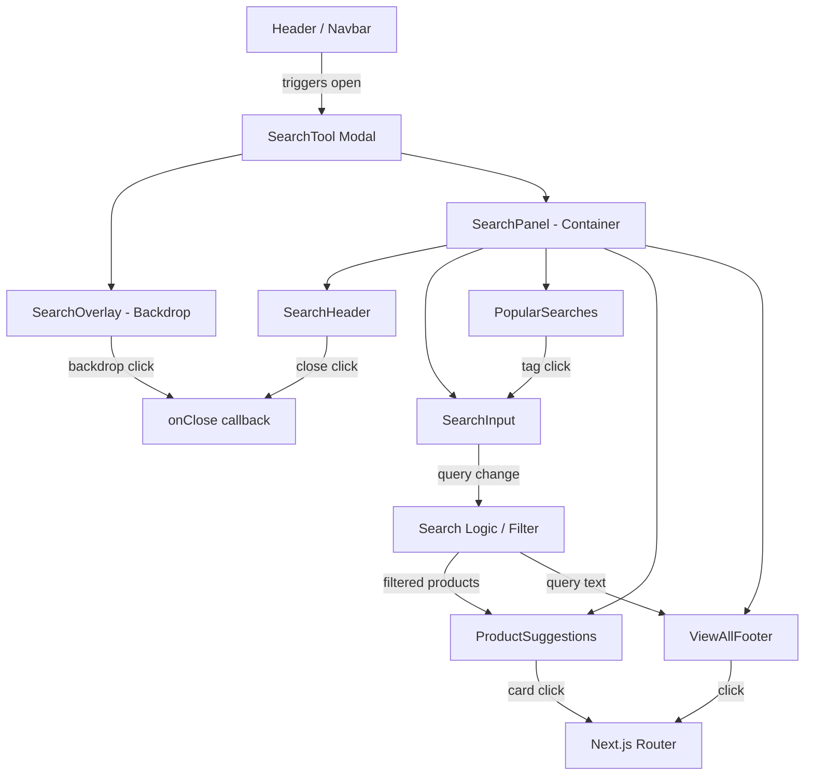
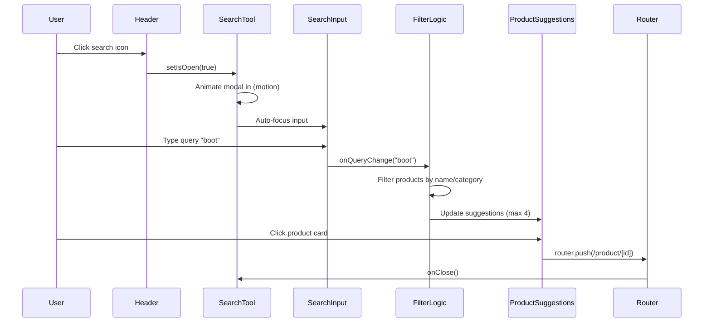
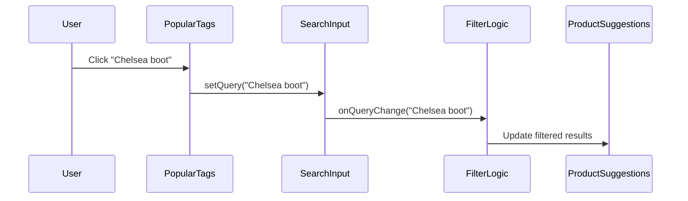
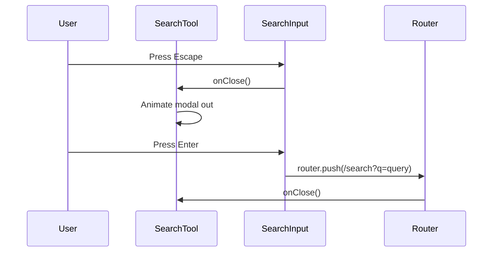

# Design Document: Search Tool

## Overview

The Search Tool is a modal overlay component for Duky Store (Vietnamese fashion e-commerce) that provides product search functionality. It features a full-width search input, popular search tag chips, product suggestion cards, and a "view all results" footer bar. The component opens as a centered modal with backdrop, supports real-time search suggestions, keyboard navigation (Escape to close, Enter to submit), and integrates with the existing product data model and routing system.

The component follows the store's luxury minimal aesthetic with Montserrat typography, pill-shaped inputs, subtle borders, and smooth animations using the motion (framer-motion) library for modal enter/exit transitions.

## Architecture



## Sequence Diagrams

### Modal Open & Search Flow



### Popular Tag Click Flow



### Keyboard Interaction Flow



## Components and Interfaces

### Component 1: SearchTool (Main Container)

**Purpose**: Root modal component that manages open/close state, backdrop, animation, and orchestrates child components.

```typescript
interface SearchToolProps {
  isOpen: boolean;
  onClose: () => void;
  products: Product[];
  popularSearches?: string[];
}
```

**Responsibilities**:
- Render backdrop overlay with click-to-close
- Animate modal panel in/out using motion (framer-motion)
- Manage search query state
- Filter products based on query
- Handle keyboard events (Escape to close)
- Trap focus within modal when open
- Prevent body scroll when open

### Component 2: SearchHeader

**Purpose**: Displays the modal title and close button.

```typescript
interface SearchHeaderProps {
  onClose: () => void;
}
```

**Responsibilities**:
- Render title "Tìm kiếm sản phẩm"
- Render close (X) button with lucide-react icon
- Call onClose on button click

### Component 3: SearchInput

**Purpose**: Full-width pill-shaped search input with search icon.

```typescript
interface SearchInputProps {
  query: string;
  onQueryChange: (query: string) => void;
  onSubmit: (query: string) => void;
  inputRef: React.RefObject<HTMLInputElement | null>;
}
```

**Responsibilities**:
- Render pill-shaped input with Search icon on left
- Display placeholder "Bạn cần tìm gì hôm nay?"
- Emit query changes on input
- Handle Enter key to submit search
- Accept ref for auto-focus

### Component 4: PopularSearches

**Purpose**: Horizontal row of clickable tag chips for popular/trending searches.

```typescript
interface PopularSearchesProps {
  tags: string[];
  onTagClick: (tag: string) => void;
}
```

**Responsibilities**:
- Render section label "Tìm kiếm phổ biến"
- Render row of pill-shaped tag chips with subtle border
- Call onTagClick when a tag is clicked

### Component 5: ProductSuggestions

**Purpose**: Horizontal grid of product suggestion cards (max 4).

```typescript
interface ProductSuggestionsProps {
  products: Product[];
  onProductClick: (product: Product) => void;
}
```

**Responsibilities**:
- Render section label "Gợi ý sản phẩm"
- Render horizontal grid of up to 4 product cards
- Each card shows: square image, product name (max 2 lines), formatted price
- Call onProductClick when a card is clicked

### Component 6: ViewAllFooter

**Purpose**: Bottom bar linking to full search results page.

```typescript
interface ViewAllFooterProps {
  query: string;
  onViewAll: (query: string) => void;
}
```

**Responsibilities**:
- Render "Xem tất cả kết quả cho '[query]'" text
- Render ArrowRight icon
- Call onViewAll on click
- Only visible when query is non-empty

## Data Models

### Product (existing)

```typescript
interface Product {
  id: string;
  name: string;
  desc: string;
  price: number;
  formattedPrice: string;
  img: string;
  category: string;
  originalPrice?: number;
  badge?: string;
  rating?: number;
  reviewsCount?: number;
  sizes?: number[];
  colors?: string[];
  gender?: "male" | "female" | "unisex";
}
```

### SearchState (internal)

```typescript
interface SearchState {
  query: string;
  filteredProducts: Product[];
  isAnimating: boolean;
}
```

**Validation Rules**:
- `query` can be empty string (shows popular searches + default suggestions)
- `filteredProducts` is capped at 4 items for display
- Search matching is case-insensitive and diacritics-aware for Vietnamese text

## Key Functions with Formal Specifications

### Function 1: filterProducts()

```typescript
function filterProducts(products: Product[], query: string): Product[]
```

**Preconditions:**
- `products` is a valid array (may be empty)
- `query` is a string (may be empty)

**Postconditions:**
- Returns array of products where `product.name` or `product.category` contains `query` (case-insensitive)
- If `query` is empty, returns first 4 products as default suggestions
- Result length is at most 4
- Original `products` array is not mutated
- Order is preserved from original array

**Loop Invariants:**
- All previously checked products that matched remain in the result set

### Function 2: normalizeVietnamese()

```typescript
function normalizeVietnamese(text: string): string
```

**Preconditions:**
- `text` is a defined string

**Postconditions:**
- Returns lowercase string with Vietnamese diacritics removed
- Original string is not mutated
- Empty string input returns empty string

### Function 3: handleKeyDown()

```typescript
function handleKeyDown(event: React.KeyboardEvent<HTMLInputElement>): void
```

**Preconditions:**
- `event` is a valid keyboard event from the search input
- Modal is currently open

**Postconditions:**
- If key is "Escape": `onClose()` is called
- If key is "Enter" and query is non-empty: navigates to search results page
- If key is "Enter" and query is empty: no navigation occurs
- No other keys trigger side effects

## Algorithmic Pseudocode

### Search Filtering Algorithm

```typescript
function filterProducts(products: Product[], query: string): Product[] {
  // Early return for empty query - show default suggestions
  if (query.trim() === "") {
    return products.slice(0, 4);
  }

  const normalizedQuery = normalizeVietnamese(query.trim());

  const filtered = products.filter((product) => {
    const normalizedName = normalizeVietnamese(product.name);
    const normalizedCategory = normalizeVietnamese(product.category);
    
    return (
      normalizedName.includes(normalizedQuery) ||
      normalizedCategory.includes(normalizedQuery)
    );
  });

  // Cap results at 4 for suggestion display
  return filtered.slice(0, 4);
}
```

**Preconditions:**
- products array is defined and iterable
- query is a defined string

**Postconditions:**
- Returns at most 4 matching products
- Matching is case-insensitive and diacritics-normalized
- Original array order is preserved

### Vietnamese Text Normalization

```typescript
function normalizeVietnamese(text: string): string {
  return text
    .toLowerCase()
    .normalize("NFD")
    .replace(/[\u0300-\u036f]/g, "")
    .replace(/đ/g, "d")
    .replace(/Đ/g, "D");
}
```

**Preconditions:**
- text is a defined string

**Postconditions:**
- All characters are lowercase
- All Vietnamese diacritical marks are removed
- đ/Đ are converted to d/D
- Result is suitable for substring matching

### Modal Lifecycle Algorithm

```typescript
// On open:
function onModalOpen(): void {
  // 1. Prevent body scroll
  document.body.style.overflow = "hidden";
  
  // 2. Reset search state
  setQuery("");
  setFilteredProducts(products.slice(0, 4));
  
  // 3. Auto-focus input after animation completes
  setTimeout(() => inputRef.current?.focus(), 100);
}

// On close:
function onModalClose(): void {
  // 1. Restore body scroll
  document.body.style.overflow = "";
  
  // 2. Call parent onClose
  onClose();
}
```

## Example Usage

```typescript
// Parent component (e.g., Header)
"use client";

import { useState } from "react";
import { SearchTool } from "@/components/shop/SeachTool";
import { Product } from "@/types/product";

export function Header({ products }: { products: Product[] }) {
  const [isSearchOpen, setIsSearchOpen] = useState(false);

  const popularSearches = [
    "Boot cổ thấp",
    "Boot cổ cao",
    "Boot đế chunky",
    "Chelsea boot",
    "Phụ kiện",
    "Outfit nữ",
  ];

  return (
    <>
      <button onClick={() => setIsSearchOpen(true)}>
        <Search size={20} />
      </button>

      <SearchTool
        isOpen={isSearchOpen}
        onClose={() => setIsSearchOpen(false)}
        products={products}
        popularSearches={popularSearches}
      />
    </>
  );
}
```

```typescript
// Inside SearchTool component usage
import { useRouter } from "next/navigation";

const router = useRouter();

const handleProductClick = (product: Product) => {
  router.push(`/product/${product.id}`);
  onClose();
};

const handleViewAll = (query: string) => {
  router.push(`/search?q=${encodeURIComponent(query)}`);
  onClose();
};

const handleSubmit = (query: string) => {
  if (query.trim()) {
    router.push(`/search?q=${encodeURIComponent(query.trim())}`);
    onClose();
  }
};
```

## Correctness Properties

*A property is a characteristic or behavior that should hold true across all valid executions of a system-essentially, a formal statement about what the system should do. Properties serve as the bridge between human-readable specifications and machine-verifiable correctness guarantees.*

### Property 1: Normalization idempotence

*For any* string x, `normalizeVietnamese(normalizeVietnamese(x)) === normalizeVietnamese(x)`. Applying normalization multiple times produces the same result as applying it once, and the function handles any Unicode input without errors.

**Validates: Requirements 3.3, 10.3**

### Property 2: Filter result cap

*For any* products array and any query string, `filterProducts(products, query).length <= 4` always holds regardless of the total number of matching products in the source array.

**Validates: Requirements 4.2**

### Property 3: Empty query default suggestions

*For any* products array, when the query is an empty string, `filterProducts(products, "")` returns the first `Math.min(products.length, 4)` products from the array in their original order.

**Validates: Requirements 4.3**

### Property 4: Filter correctness and order preservation

*For any* non-empty query and products array, every product in `filterProducts(products, query)` has a name or category that contains the normalized query, and the results maintain their relative order from the original array.

**Validates: Requirements 4.1, 4.4**

### Property 5: No mutation

*For any* products array and any query string, calling `filterProducts(products, query)` does not mutate the input products array. The original array reference and contents remain unchanged after any number of filter calls.

**Validates: Requirements 4.5**

### Property 6: Tag click updates query

*For any* popular search tag text value, clicking that tag sets the search query to exactly that tag's text, which triggers product filtering with the new query value.

**Validates: Requirements 5.2, 5.3**

### Property 7: Escape always closes

*For any* query state (empty or non-empty) and any focus state within the modal, pressing the Escape key always triggers the modal close callback.

**Validates: Requirements 8.1**

### Property 8: Scroll restore on close

*For any* initial document body scroll state, opening and then closing the Search_Tool restores `document.body.style.overflow` to its previous value.

**Validates: Requirements 1.4, 1.5**

### Property 9: Navigation URL correctness

*For any* non-empty query string, submitting via Enter navigates to `/search?q=[encodeURIComponent(query)]`. *For any* product with an id, clicking its suggestion card navigates to `/product/[id]`. *For any* non-empty query, clicking View All navigates to `/search?q=[encodeURIComponent(query)]`.

**Validates: Requirements 6.2, 7.3, 8.2**

## Error Handling

### Error Scenario 1: Empty Product List

**Condition**: `products` prop is an empty array
**Response**: ProductSuggestions section renders empty state (section hidden or shows "Không có gợi ý")
**Recovery**: Component remains functional; popular searches and input still work

### Error Scenario 2: Product Image Load Failure

**Condition**: Product image URL returns 404 or fails to load
**Response**: Next.js Image component shows fallback/placeholder via `onError` or CSS background
**Recovery**: Product card remains clickable with name and price visible

### Error Scenario 3: Invalid Characters in Query

**Condition**: User pastes special characters or extremely long text
**Response**: `normalizeVietnamese` handles any Unicode input gracefully; query is trimmed
**Recovery**: No crash; filter returns empty results if no match

### Error Scenario 4: Rapid Input (Debounce)

**Condition**: User types very quickly, triggering many re-renders
**Response**: Optional debounce (150-200ms) on filter execution to avoid excessive computation
**Recovery**: Final query state always reflects the latest input value

## Testing Strategy

### Unit Testing Approach

- Test `filterProducts` with various queries (exact match, partial match, no match, empty query)
- Test `normalizeVietnamese` with Vietnamese diacritics, plain ASCII, empty strings, special characters
- Test keyboard handlers (Escape closes, Enter submits, other keys no-op)
- Test that `filteredProducts` never exceeds 4 items

### Property-Based Testing Approach

**Property Test Library**: fast-check

- **Filter subset property**: For any query, `filterProducts(products, query)` is a subset of `products`
- **Length cap property**: For any input, result length ≤ 4
- **Normalization idempotence**: `normalize(normalize(x)) === normalize(x)` for arbitrary strings
- **Empty query returns defaults**: `filterProducts(products, "").length === Math.min(products.length, 4)`

### Integration Testing Approach

- Test modal open/close animation lifecycle
- Test that clicking a product card navigates to correct URL
- Test that "View All" navigates with correct query parameter
- Test body scroll lock/unlock on open/close
- Test auto-focus behavior on modal open

## Performance Considerations

- **Filter debounce**: Apply 150ms debounce on search input to avoid filtering on every keystroke
- **Image optimization**: Use Next.js Image with appropriate `sizes` prop and lazy loading for suggestion cards
- **Animation performance**: Use `motion` (framer-motion) with `transform` and `opacity` only for GPU-accelerated animations
- **Memoization**: Memoize `filterProducts` result with `useMemo` keyed on `[products, query]`
- **Portal rendering**: Render modal via React portal to avoid layout thrashing in parent component tree
- **Product list size**: If product list is large (>100 items), consider pre-indexing or using a search index rather than linear filter

## Security Considerations

- **XSS prevention**: Query string is used via React's JSX interpolation (auto-escaped); never inserted as raw HTML
- **URL encoding**: `encodeURIComponent` used when building search URLs to prevent injection
- **Input sanitization**: No server-side calls in this component (client-side filter only), but query should be sanitized before any future API calls

## Dependencies

- `react` / `react-dom` (v19) — Core UI framework
- `next` (v16) — App Router, Image component, useRouter
- `motion` (framer-motion v12) — Modal enter/exit animations (AnimatePresence, motion.div)
- `lucide-react` — Icons (Search, X, ArrowRight)
- `@/lib/utils` — `cn()` for className merging, `formatCurrency()` for price display
- `@/types/product` — Product interface
