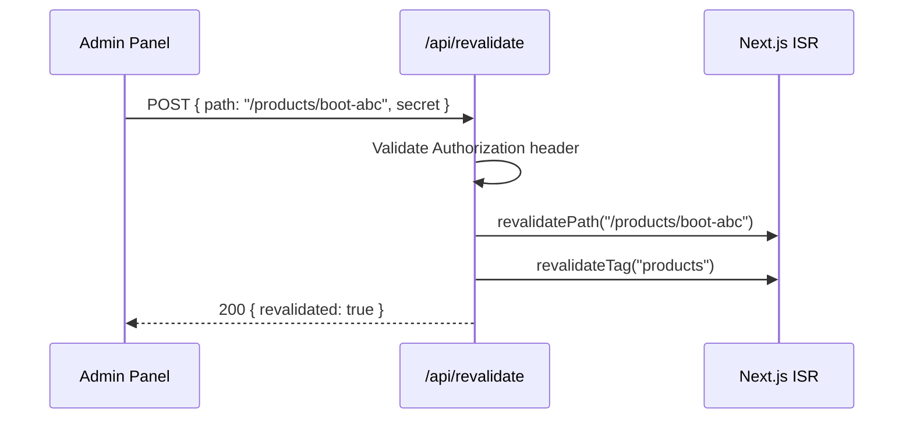

# Technical Design Document: SEO & Performance Optimization

## Overview

This design converts the Duky Store Next.js frontend from fully client-rendered pages (`"use client"`) to a **Server Component shell + Client Component islands** architecture. The server shell handles data fetching and SEO-critical HTML rendering via ISR, while interactive elements (cart, filters, animations) remain as hydrated client islands.

Key goals:
- Pre-render all public pages as static HTML with ISR for search engine indexing
- Generate comprehensive SEO metadata (Open Graph, Twitter Cards) per page
- Emit JSON-LD structured data for rich search results
- Produce a dynamic sitemap and robots.txt
- Provide on-demand revalidation for instant cache updates
- Optimize bundle size and Core Web Vitals through code splitting and Suspense

The existing `src/lib/api.ts` already uses `fetch` with `{ next: { revalidate: 60 } }`, so the ISR data layer is partially in place. The main work is converting page components from client to server, extracting interactive pieces into client islands, and adding metadata/structured data generation.

## Architecture

### High-Level: Server Shell + Client Islands

```mermaid
graph TD
    subgraph "Server (Build/ISR)"
        A[Page Server Component] --> B[Data Fetching via api.ts]
        A --> C[generateMetadata]
        A --> D[JSON-LD Script Tag]
        A --> E[Static HTML Shell]
    end

    subgraph "Client Islands (Hydrated)"
        F[CartToast]
        G[FilterSidebar]
        H[ProductInteractions]
        I[AnimatedSections]
    end

    E --> F
    E --> G
    E --> H
    E --> I

    subgraph "SEO Infrastructure"
        J[sitemap.ts]
        K[robots.ts]
        L[/api/revalidate]
    end
```

### ISR Data Flow

```mermaid
sequenceDiagram
    participant Browser
    participant NextJS as Next.js Edge/Node
    participant Cache as ISR Cache
    participant API as NestJS Backend

    Browser->>NextJS: GET /collections/boot-nam
    NextJS->>Cache: Check cached page
    alt Cache HIT (within revalidate window)
        Cache-->>NextJS: Return cached HTML
        NextJS-->>Browser: Serve static HTML
    else Cache STALE (past revalidate window)
        Cache-->>NextJS: Return stale HTML (serve immediately)
        NextJS-->>Browser: Serve stale HTML
        NextJS->>API: Background fetch products
        API-->>NextJS: Product data
        NextJS->>Cache: Store regenerated page
    end
```



### On-Demand Revalidation Flow



## Components and Interfaces

### Page Component Architecture

Each page follows the pattern:

```
src/app/(shop)/[route]/page.tsx        → Server Component (data fetch + shell)
src/app/(shop)/[route]/[Name]Client.tsx → Client Component (interactivity)
```

#### Homepage (`src/app/(shop)/page.tsx`)

```typescript
// Server Component - no "use client"
export const revalidate = 120;

export async function generateMetadata(): Promise<Metadata> { ... }

export default async function ShopPage() {
  const [products, categories, posts] = await Promise.all([...]);
  return (
    <>
      <JsonLd data={websiteSchema} />
      <Header />
      <HeroBanner trustItems={trustItems} />
      <CategorySection categories={categories} />
      <Suspense fallback={<SectionSkeleton />}>
        <LazyBootMaleSection products={maleProducts} />
      </Suspense>
      {/* ... more lazy sections */}
      <Footer />
      <CartToastClient />  {/* Client island */}
    </>
  );
}
```

#### Collection Page (`src/app/(shop)/collections/[slug]/page.tsx`)

```typescript
// Server Component
export const revalidate = 60;

export async function generateStaticParams() {
  return [
    { slug: "boot-nam" },
    { slug: "boot-nu" },
    { slug: "phu-kien" },
    { slug: "outfit" },
  ];
}

export async function generateMetadata({ params }): Promise<Metadata> { ... }

export default async function CollectionPage({ params }) {
  const { slug } = await params;
  const products = await fetchProducts({ categorySlug: slug, limit: 100 });
  return (
    <>
      <JsonLd data={breadcrumbSchema} />
      <HeroBanner meta={COLLECTION_META[slug]} />
      <CollectionClient initialProducts={products.data} slug={slug} />
    </>
  );
}
```

#### Product Detail Page (`src/app/(shop)/products/[slug]/page.tsx`)

```typescript
// Server Component
export const revalidate = 60;

export async function generateMetadata({ params }): Promise<Metadata> { ... }

export default async function ProductDetailPage({ params }) {
  const { slug } = await params;
  const [product, variants] = await Promise.all([
    fetchProductBySlug(slug),
    fetchProductVariants(slug),
  ]);
  if (!product) notFound();
  return (
    <>
      <JsonLd data={productSchema(product)} />
      <JsonLd data={breadcrumbSchema(product)} />
      <ProductDetailClient product={product} variants={variants.data} />
    </>
  );
}
```

### Shared Components

| Component | Type | Purpose |
|-----------|------|---------|
| `JsonLd` | Server | Renders `<script type="application/ld+json">` |
| `CartToastClient` | Client | Toast notification for cart actions |
| `CollectionClient` | Client | Filters, pagination, favorites state |
| `ProductDetailClient` | Client | Size/color selectors, add-to-cart, image gallery |
| `LazyBootMaleSection` | Client (dynamic) | Below-fold animated section |
| `LazyBootFemaleSection` | Client (dynamic) | Below-fold animated section |
| `LazyGuideSection` | Client (dynamic) | Below-fold animated section |
| `LazyNewsSection` | Client (dynamic) | Below-fold animated section |
| `LazyFAQSection` | Client (dynamic) | Below-fold FAQ accordion |

### Metadata Generator Interface

```typescript
// src/lib/metadata.ts
export interface PageMetadataInput {
  title: string;
  description: string;
  path: string;
  image?: string;
  type?: "website" | "article" | "product";
}

export function buildMetadata(input: PageMetadataInput): Metadata {
  const siteUrl = process.env.NEXT_PUBLIC_SITE_URL || "https://dukystore.vn";
  return {
    title: `${input.title} | Duky Store`,
    description: input.description,
    alternates: { canonical: `${siteUrl}${input.path}` },
    openGraph: {
      title: `${input.title} | Duky Store`,
      description: input.description,
      url: `${siteUrl}${input.path}`,
      type: input.type || "website",
      images: input.image ? [{ url: input.image }] : undefined,
      siteName: "Duky Store",
    },
    twitter: {
      card: input.image ? "summary_large_image" : "summary",
      title: `${input.title} | Duky Store`,
      description: input.description,
      images: input.image ? [input.image] : undefined,
    },
  };
}
```

### JSON-LD Structured Data Interface

```typescript
// src/lib/structured-data.ts
export function buildProductJsonLd(product: Product): object { ... }
export function buildBreadcrumbJsonLd(items: { name: string; url: string }[]): object { ... }
export function buildWebsiteJsonLd(): object { ... }
export function buildArticleJsonLd(post: BlogPost): object { ... }

// Shared renderer component
// src/components/seo/JsonLd.tsx
export function JsonLd({ data }: { data: object }) {
  return (
    <script
      type="application/ld+json"
      dangerouslySetInnerHTML={{
        __html: JSON.stringify(data).replace(/</g, "\\u003c"),
      }}
    />
  );
}
```

### Revalidation Endpoint Interface

```typescript
// src/app/api/revalidate/route.ts
// POST /api/revalidate
// Headers: Authorization: Bearer <REVALIDATION_SECRET>
// Body: { path?: string, tag?: string }
// Response: { revalidated: true } | { error: string }
```

## Data Models

### Metadata Generation Data Flow

```typescript
// Input: Page-specific data from API
interface ProductMetadataSource {
  name: string;
  slug: string;
  originalPrice?: number;
  salePrice?: number | null;
  thumbnailMedia?: { url: string; secureUrl: string | null } | null;
  desc?: string;
}

interface CollectionMetadataSource {
  slug: string;
  title: string;
  description: string;
  heroImage: string;
}

interface BlogMetadataSource {
  title: string;
  slug: string;
  excerpt: string | null;
  coverMedia?: { url: string; secureUrl: string | null } | null;
  seo?: BlogSeo | null;
}
```

### JSON-LD Schema Structures

```typescript
// Product schema (schema.org/Product)
interface ProductJsonLd {
  "@context": "https://schema.org";
  "@type": "Product";
  name: string;
  description: string;
  image: string[];
  sku: string;
  brand: { "@type": "Brand"; name: string };
  offers: {
    "@type": "Offer";
    price: number;
    priceCurrency: "VND";
    availability: string;
    url: string;
  } | {
    "@type": "AggregateOffer";
    lowPrice: number;
    highPrice: number;
    priceCurrency: "VND";
    offerCount: number;
  };
}

// BreadcrumbList schema
interface BreadcrumbJsonLd {
  "@context": "https://schema.org";
  "@type": "BreadcrumbList";
  itemListElement: {
    "@type": "ListItem";
    position: number;
    name: string;
    item: string;
  }[];
}

// WebSite schema with SearchAction
interface WebsiteJsonLd {
  "@context": "https://schema.org";
  "@type": "WebSite";
  name: "Duky Store";
  url: string;
  potentialAction: {
    "@type": "SearchAction";
    target: { "@type": "EntryPoint"; urlTemplate: string };
    "query-input": "required name=search_term_string";
  };
}
```

### Sitemap Data Structure

```typescript
// Next.js App Router sitemap return type
interface SitemapEntry {
  url: string;
  lastModified?: Date | string;
  changeFrequency?: "always" | "hourly" | "daily" | "weekly" | "monthly" | "yearly" | "never";
  priority?: number;
}
```

### Revalidation Request/Response

```typescript
interface RevalidateRequest {
  path?: string;   // e.g., "/products/boot-abc"
  tag?: string;    // e.g., "products" or "collections"
}

interface RevalidateResponse {
  revalidated: boolean;
  message?: string;
}
```

## Correctness Properties

*A property is a characteristic or behavior that should hold true across all valid executions of a system — essentially, a formal statement about what the system should do. Properties serve as the bridge between human-readable specifications and machine-verifiable correctness guarantees.*

### Property 1: Title follows site pattern

*For any* page with a title string, the `buildMetadata` function SHALL produce a title matching the pattern `"{title} | Duky Store"`.

**Validates: Requirements 5.1**

### Property 2: Product metadata contains product name and price

*For any* valid product object with a name and price, the generated metadata title and description SHALL contain the product name, and the description SHALL contain a formatted price string.

**Validates: Requirements 5.3**

### Property 3: Collection metadata contains collection name

*For any* valid collection with a known slug and title, the generated metadata title SHALL contain the collection title.

**Validates: Requirements 5.4**

### Property 4: All pages have complete Open Graph and Twitter Card fields

*For any* page metadata input with title, description, and path, the generated metadata SHALL include non-empty `openGraph.title`, `openGraph.description`, `openGraph.url`, `openGraph.type`, `twitter.card`, `twitter.title`, and `twitter.description` fields.

**Validates: Requirements 5.5, 5.6**

### Property 5: Product og:image matches thumbnail URL

*For any* product with a non-null `thumbnailMedia` containing a URL, the generated metadata `openGraph.images[0].url` SHALL equal the product's thumbnail secure URL (or URL if secureUrl is null).

**Validates: Requirements 5.7**

### Property 6: Product JSON-LD contains all required schema fields

*For any* valid product object, the `buildProductJsonLd` function SHALL produce an object containing `@type: "Product"`, non-empty `name`, `description`, `image`, `sku`, `brand.name`, and `offers` with `price` and `priceCurrency`.

**Validates: Requirements 6.1, 6.2**

### Property 7: BreadcrumbList JSON-LD is valid for any path

*For any* non-empty array of breadcrumb items (each with name and url), the `buildBreadcrumbJsonLd` function SHALL produce a valid `BreadcrumbList` with sequential `position` values starting at 1 and matching item count.

**Validates: Requirements 6.3**

### Property 8: Article JSON-LD is valid for any blog post

*For any* valid blog post object with title, content, and dates, the `buildArticleJsonLd` function SHALL produce an object with `@type` containing "Article" or "BlogPosting", non-empty `headline`, and valid `datePublished`.

**Validates: Requirements 6.5**

### Property 9: Sale price products include both prices in offers

*For any* product where `salePrice` is non-null and less than `originalPrice`, the `buildProductJsonLd` function SHALL include both the sale price and the original price in the offers structure.

**Validates: Requirements 6.6**

### Property 10: All published entities appear in sitemap

*For any* set of published products and blog posts returned by the API, the sitemap generator output SHALL contain a URL entry for each product slug and each blog post slug.

**Validates: Requirements 7.2, 7.4**

### Property 11: Valid revalidation request triggers revalidation and returns 200

*For any* POST request to `/api/revalidate` with a valid Authorization token and a JSON body containing a non-empty `path` or `tag`, the endpoint SHALL call the appropriate revalidation function and return status 200 with `{ revalidated: true }`.

**Validates: Requirements 9.2, 9.6**

### Property 12: Invalid auth token returns 401

*For any* POST request to `/api/revalidate` where the Authorization header is missing or does not match the configured secret, the endpoint SHALL return status 401 regardless of the request body content.

**Validates: Requirements 9.4**

### Property 13: Product revalidation cascades to collection pages

*For any* revalidation request targeting a product path (matching `/products/[slug]`), the endpoint SHALL also trigger revalidation for the `"collections"` tag to ensure collection pages reflect updated product data.

**Validates: Requirements 9.5**

## Error Handling

### API Fetch Failures

| Scenario | Handling |
|----------|----------|
| API returns 404 for product/blog slug | Call `notFound()` → Next.js renders 404 page |
| API returns 5xx or network error | Let error propagate → Next.js error boundary renders error page; stale ISR cache continues serving |
| API timeout during ISR revalidation | Stale page continues serving; next request retries |

### Revalidation Endpoint Errors

| Scenario | Response |
|----------|----------|
| Missing Authorization header | 401 `{ error: "Unauthorized" }` |
| Invalid secret token | 401 `{ error: "Unauthorized" }` |
| Missing both `path` and `tag` in body | 400 `{ error: "Missing path or tag" }` |
| `revalidatePath`/`revalidateTag` throws | 500 `{ error: "Revalidation failed" }` |

### Metadata Generation Fallbacks

- If product has no description → use product name as description
- If product has no thumbnail → omit og:image (don't set to placeholder)
- If collection slug is unknown → return generic "Duky Store" metadata
- If blog post has no SEO data → fall back to title/excerpt

### Structured Data Fallbacks

- If product has no SKU → omit `sku` field (schema.org allows optional)
- If product has no images → use placeholder URL
- If blog post has no author → use "Duky Store" as organization author

## Testing Strategy

### Property-Based Testing

This feature is suitable for property-based testing because the metadata generators, JSON-LD builders, and revalidation endpoint are pure functions (or near-pure with mockable dependencies) with clear input/output behavior and a large input space.

**Library:** [fast-check](https://github.com/dubzzz/fast-check) (TypeScript PBT library)

**Configuration:**
- Minimum 100 iterations per property test
- Each test tagged with: `Feature: seo-performance-optimization, Property {N}: {title}`

**Property tests to implement:**
- Properties 1–13 as defined in Correctness Properties section
- Generators for: random Product objects, random BlogPost objects, random breadcrumb arrays, random revalidation requests

### Unit Tests (Example-Based)

| Test | Validates |
|------|-----------|
| Homepage renders with revalidate = 120 | Req 1.1 |
| Collection page generateStaticParams returns 4 slugs | Req 2.5 |
| Product page calls notFound() on 404 | Req 3.5 |
| Blog page calls notFound() on 404 | Req 4.4 |
| WebSite JSON-LD contains SearchAction | Req 6.4 |
| Sitemap includes 4 collection URLs | Req 7.3 |
| Sitemap includes static pages | Req 7.5 |
| Sitemap has correct changeFrequency/priority | Req 7.6 |
| Robots.txt allows public paths | Req 8.2 |
| Robots.txt disallows private paths | Req 8.3 |
| Robots.txt references sitemap | Req 8.4 |

### Integration Tests

| Test | Validates |
|------|-----------|
| Homepage fetches products, categories, posts from API | Req 1.3 |
| Collection page fetches products by slug | Req 2.2 |
| Product page fetches product + variants | Req 3.2 |
| Blog page fetches full post content | Req 4.3 |
| Revalidation endpoint calls revalidatePath with correct path | Req 9.2 |

### Visual/Snapshot Tests

- Homepage layout matches before/after conversion (Req 1.4)
- Above-fold sections render without lazy loading wrappers (Req 10.4)

### File Structure Changes

```
src/
├── app/
│   ├── (shop)/
│   │   ├── page.tsx                          # Convert: Server Component shell
│   │   ├── HomeClient.tsx                    # NEW: Cart toast + animated sections
│   │   ├── collections/[slug]/
│   │   │   ├── page.tsx                      # Convert: Server Component shell
│   │   │   └── CollectionClient.tsx          # NEW: Filters + pagination
│   │   ├── products/[slug]/
│   │   │   ├── page.tsx                      # Convert: Server Component shell
│   │   │   └── ProductDetailClient.tsx       # NEW: Interactions
│   │   └── blog/
│   │       ├── page.tsx                      # Already partially server
│   │       └── [slug]/page.tsx               # Already server component
│   ├── api/
│   │   └── revalidate/
│   │       └── route.ts                      # NEW: Revalidation endpoint
│   ├── sitemap.ts                            # NEW: Dynamic sitemap
│   └── robots.ts                             # NEW: Robots.txt
├── components/
│   └── seo/
│       └── JsonLd.tsx                        # NEW: JSON-LD renderer
├── lib/
│   ├── api.ts                                # MODIFY: Add tag-based caching
│   ├── metadata.ts                           # NEW: Metadata builder utility
│   └── structured-data.ts                    # NEW: JSON-LD schema builders
└── types/
    └── (existing types unchanged)
```

### Performance Optimization Approach

**Dynamic Imports for Below-Fold Sections:**
```typescript
import dynamic from "next/dynamic";

const LazyBootMaleSection = dynamic(
  () => import("@/components/shop/home/BootMaleSection"),
  { loading: () => <SectionSkeleton height="600px" /> }
);
```

**Suspense Boundaries:**
- Each below-fold section wrapped in `<Suspense>` with skeleton fallback
- Above-fold (HeroBanner, CategorySection) rendered synchronously

**Bundle Optimization:**
- `motion/react` and `gsap` only imported in Client Components
- Server shell imports zero animation libraries
- Next.js automatically code-splits Client Components

**Image Optimization:**
- All images use `next/image` with explicit `width`/`height` or `fill` + container aspect ratio
- Above-fold images: `priority={true}`
- Below-fold images: default lazy loading
- `sizes` attribute set for responsive images to prevent oversized downloads
